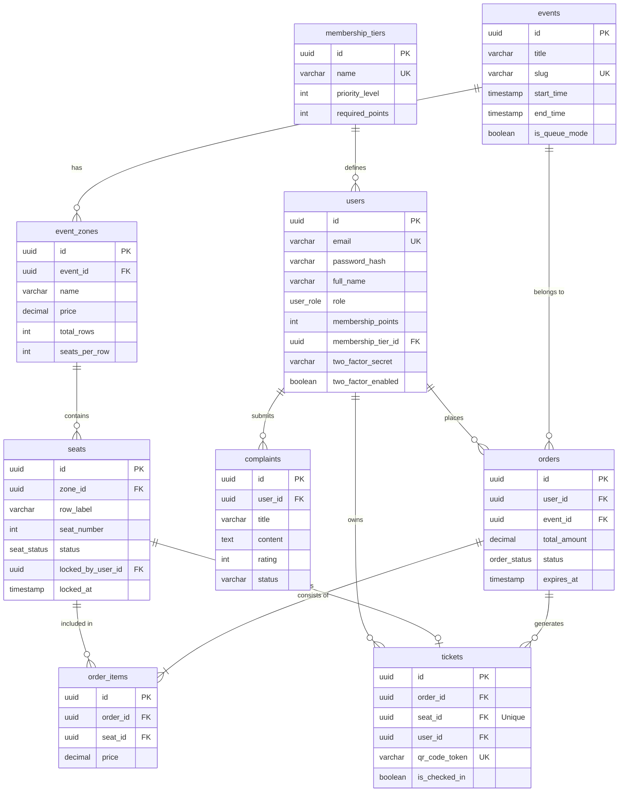
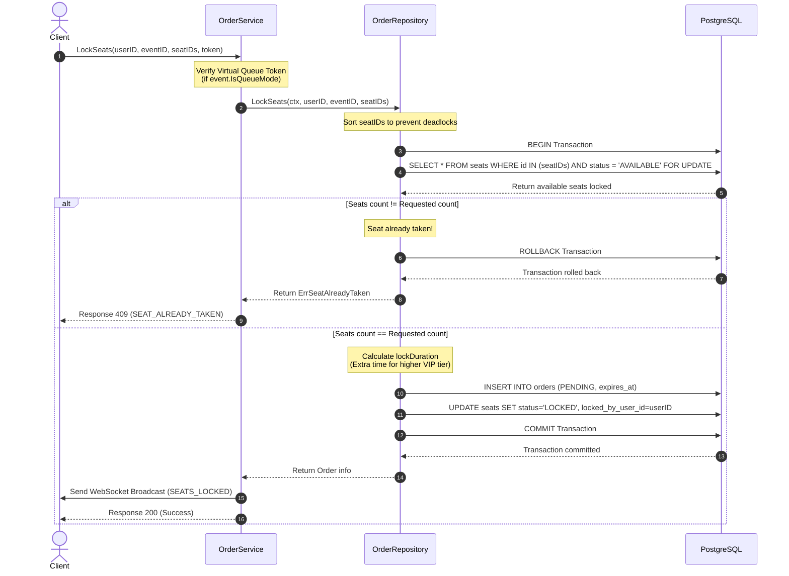
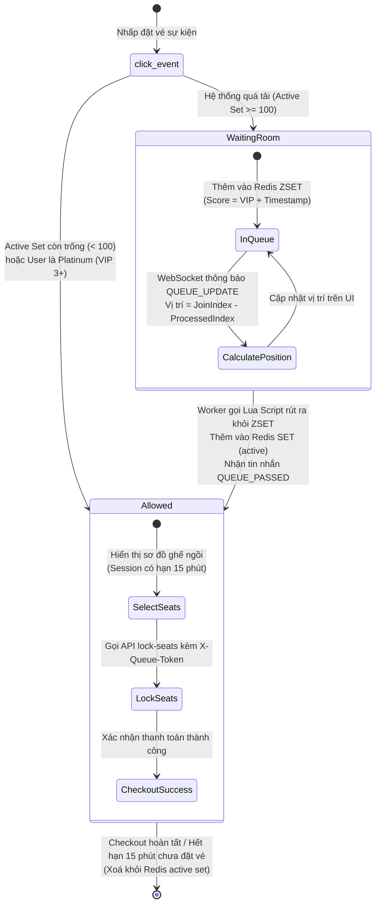
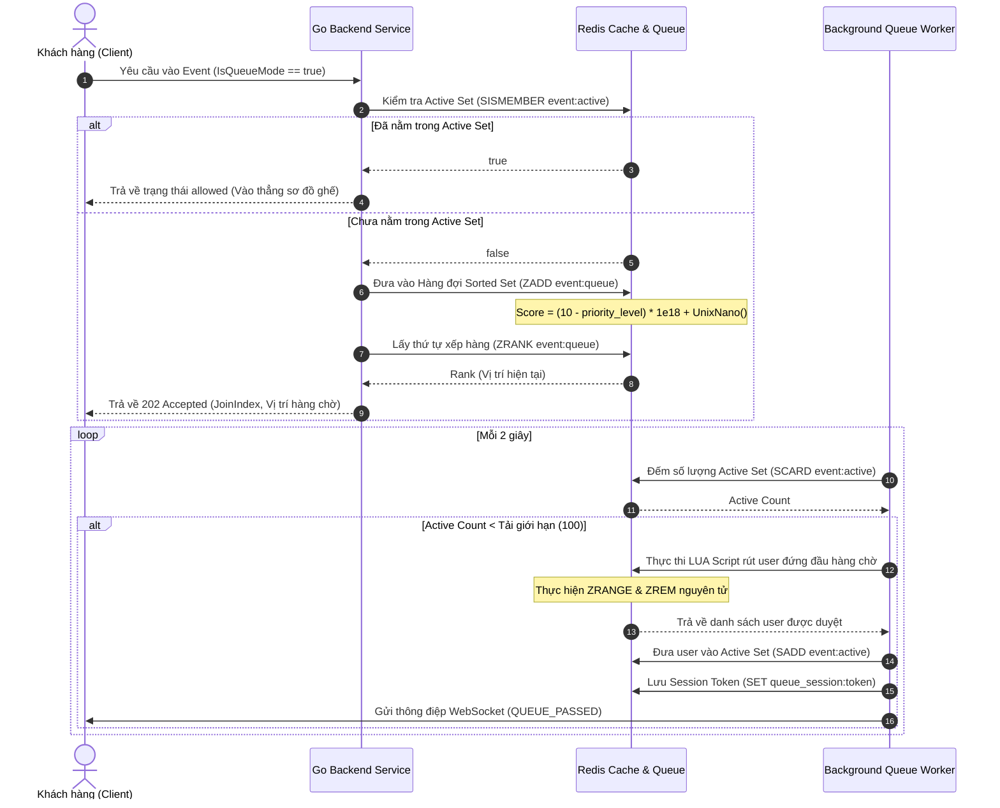
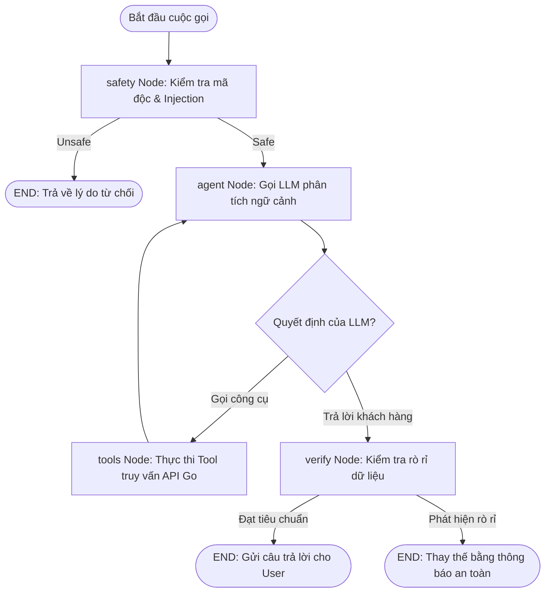
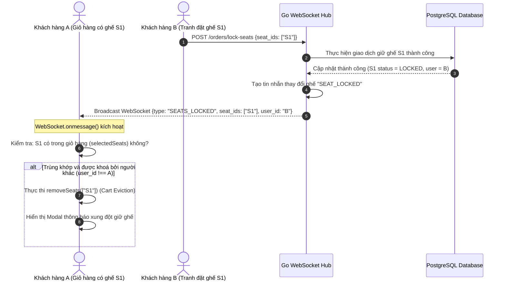
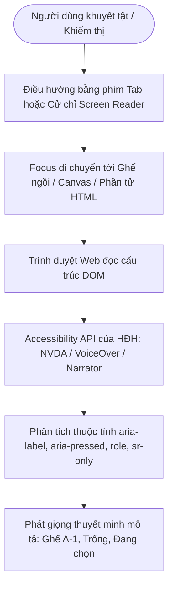

# TÀI LIỆU KỸ THUẬT HỆ THỐNG TICKETRUSH (DEVELOPER TECHNICAL DOCUMENTATION)

Tài liệu này được biên soạn chi tiết dành cho các kỹ sư phát triển phần mềm, kiến trúc sư hệ thống, và giảng viên đánh giá dự án **TicketRush**. Nội dung bao gồm toàn bộ thiết kế kiến trúc, cấu trúc cơ sở dữ liệu, các luồng nghiệp vụ cốt lõi xử lý tải cao, hệ thống trí tuệ nhân tạo (AI Agent) và hướng dẫn chạy mô phỏng (demo) hệ thống.

---

## PHẦN 1: TỔNG QUAN HỆ THỐNG & TECH STACK

TicketRush được thiết kế dựa trên mô hình phân tách rõ ràng giữa Front-end, Back-end và AI Service. Sự kết hợp này mang lại khả năng chịu tải tốt, tính sẵn sàng cao và khả năng mở rộng linh hoạt.

### 1. Kiến trúc Tổng thể (System Architecture)
Hệ thống bao gồm ba cấu phần chính:
1. **Go Back-end (Clean Architecture)**: Đóng vai trò là trung tâm xử lý nghiệp vụ, quản lý dữ liệu và cung cấp API. Hệ thống tuân thủ chặt chẽ kiến trúc Clean Architecture chia làm các tầng:
   - **Tầng Giao tiếp (Handlers & Middlewares)**: Nhận yêu cầu HTTP từ Client, kiểm tra tính hợp lệ của dữ liệu đầu vào, thực hiện xác thực và phân quyền.
   - **Tầng Nghiệp vụ (Services)**: Chứa toàn bộ logic nghiệp vụ của hệ thống (quản lý đơn hàng, tính toán giá vé, tích hợp dịch vụ phụ trợ).
   - **Tầng Dữ liệu (Repositories)**: Thực hiện tương tác trực tiếp với cơ sở dữ liệu PostgreSQL (qua GORM) và bộ nhớ đệm Redis (qua go-redis client).
   - **Tầng Thực thể (Models)**: Định nghĩa cấu trúc dữ liệu và các ràng buộc thực thể.
2. **React Front-end (SPA)**: Ứng dụng Single Page xây dựng trên nền tảng Vite, React 18, React Router để điều hướng, và Tailwind CSS cho giao diện. Đồng bộ dữ liệu sử dụng React Context (quản lý giỏ hàng) và kết nối WebSocket thời gian thực (hiển thị sơ đồ ghế).
3. **Python AI Agent (LangGraph API)**: Dịch vụ hỗ trợ khách hàng tự động được xây dựng bằng Python sử dụng thư viện LangGraph (StateGraph) để quản lý hội thoại theo trạng thái và FastAPI làm cổng kết nối API bảo mật với Go Back-end.

```
+-------------------------------------------------------------+
|                     React SPA Frontend                      |
|            (React Context, WebSocket Client, Vite)          |
+------------------------------+------------------------------+
                               | HTTPS / WSS
                               v
+-------------------------------------------------------------+
|                       Go API Gateway                        |
|              (Gin Web Framework & WS Upgrader)              |
+----+-------------------------+-------------------------+----+
     |                         |                         |
     | PostgreSQL (GORM)       | Redis Command           | HTTPS Proxy
     v                         v                         v
+----+---------+         +----+---------+         +----+---------+
|  PostgreSQL  |         |    Redis     |         |  FastAPI AI  |
|  Database    |         | Cache/Queue  |         |  LangGraph   |
+--------------+         +--------------+         +--------------+
```

### 2. Công nghệ & Thư viện Chính (Tech Stack)
- **Go Backend**:
  - [Gin-Gonic](https://github.com/gin-gonic/gin): Web framework xử lý định tuyến hiệu năng cao.
  - [GORM](https://gorm.io/): ORM tương tác với PostgreSQL, hỗ trợ transactions nâng cao và Row-level locking.
  - [Go-Redis/v9](https://github.com/redis/go-redis): Client tương tác Redis hiệu năng cao, hỗ trợ pipeline và thực thi script Lua.
  - [Gorilla WebSocket](https://github.com/gorilla/websocket): Nâng cấp kết nối HTTP lên giao thức TCP song công thời gian thực.
  - [Go-TOTP](https://github.com/pquerna/otp): Sinh và kiểm thực mã 2FA.
- **React Frontend**:
  - [Vite](https://vite.dev/): Công cụ đóng gói (bundler) siêu nhanh cho môi trường phát triển.
  - [TanStack Query](https://tanstack.com/query/): Đồng bộ dữ liệu bất đồng bộ từ server và tối ưu hóa bộ nhớ đệm.
  - [Tailwind CSS](https://tailwindcss.com/) & [shadcn/ui](https://ui.shadcn.com/): Thư viện giao diện linh hoạt, hiện đại.
- **Python AI Agent**:
  - [LangGraph](https://github.com/langchain-ai/langgraph): Thư viện thiết kế và kiểm soát luồng hoạt động của Agent dưới dạng một đồ thị trạng thái tuần tự.
  - [FastAPI](https://fastapi.tiangolo.com/): Tạo cổng dịch vụ HTTP nhanh và có sẵn tự động tài liệu OpenAPI.
  - [LangGraph](https://github.com/langchain-ai/langgraph): Thư viện thiết kế và kiểm soát luồng hoạt động của Agent dưới dạng một đồ thị trạng thái tuần tự.

### 3. Cấu trúc Thư mục & Giải thích các Tệp Backend

Mã nguồn Back-end của TicketRush được viết bằng ngôn ngữ Go và tổ chức theo cấu trúc tiêu chuẩn, giúp phân tách rõ ràng trách nhiệm giữa các tầng (Clean Architecture):

- **Thư mục `cmd/`**: Chứa các tệp điểm khởi đầu (entry points) chạy ứng dụng hoặc chạy các tập lệnh tiện ích.
  - [cmd/server/main.go](../cmd/server/main.go): Điểm khởi chạy chính của Go Web Server. Tệp này khởi tạo cấu hình môi trường, thiết lập các kết nối cơ sở dữ liệu (PostgreSQL, Redis), đăng ký các routes bằng framework Gin, khởi động các worker chạy ngầm, cấu hình kết nối WebSocket và khởi chạy cổng lắng nghe HTTP (mặc định port `:8080`).
  - [cmd/seed/main.go](../cmd/seed/main.go): Tập lệnh seeder phục vụ việc tạo dữ liệu mẫu phức tạp ban đầu cho các bảng dữ liệu (người dùng, sự kiện, khu vực, hạng thành viên, và sơ đồ hàng chục ngàn ghế ngồi của sân vận động) để phục vụ kiểm thử hệ thống.

- **Thư mục `internal/`**: Chứa toàn bộ mã nguồn xử lý nghiệp vụ chính của ứng dụng và được bảo vệ (không cho phép import trực tiếp từ bên ngoài hệ thống theo tiêu chuẩn Go).
  - **`config/`**: Khởi tạo và tải cấu hình hệ thống (như biến môi trường `.env`, cấu hình kết nối PostgreSQL qua GORM và Redis qua Client).
  - **`dto/`** (Data Transfer Object): Định nghĩa cấu trúc dữ liệu gửi và nhận qua API. Các struct ở đây được trang bị các validation tag của Gin (ví dụ: `binding:"required"`) để tự động kiểm tra dữ liệu đầu vào.
    - [dto/user.go](../internal/dto/user.go): Cấu trúc request/response cho luồng đăng ký, đăng nhập, xác thực 2FA.
    - [dto/order.go](../internal/dto/order.go): Schema gửi lên khi khóa ghế (`LockSeats`) và thanh toán đơn hàng.
  - **`models/`**: Định nghĩa cấu trúc của các bảng dữ liệu tương thích với GORM ORM. Áp dụng UUID cho khóa chính và định nghĩa quan hệ giữa các bảng.
    - [models/user.go](../internal/models/user.go): Thực thể người dùng, hạng thành viên, mã 2FA Secret.
    - [models/event.go](../internal/models/event.go): Mô tả thông tin sự kiện, múi giờ, trạng thái phòng chờ ảo.
    - [models/order.go](../internal/models/order.go): Đại diện cho đơn hàng, thời gian hết hạn (`ExpiresAt`) và quan hệ với chi tiết vé.
  - **`repository/`**: Tầng giao tiếp cơ sở dữ liệu trực tiếp. Thực hiện các câu lệnh SQL nâng cao, truy vấn tối ưu và kiểm soát giao dịch (database transaction).
    - [postgres.go](../internal/repository/postgres.go) & [redis.go](../internal/repository/redis.go): Thiết lập kết nối đến cơ sở dữ liệu.
    - [order_repository.go](../internal/repository/order_repository.go): Thực hiện giao dịch nguyên tử khóa ghế (`SELECT ... FOR UPDATE`), hủy đơn hàng và khôi phục trạng thái ghế.
    - [event_repository.go](../internal/repository/event_repository.go): Lấy thông tin chi tiết sơ đồ ghế, khu vực.
  - **`service/`**: Tầng nghiệp vụ (Business Logic) điều phối luồng xử lý. Tầng này nhận đầu vào từ Handler, gọi Repository để thay đổi trạng thái, thực hiện các tính toán nâng cao (giá vé, chiết khấu hạng thành viên) và gửi email/thông báo bất đồng bộ.
    - [auth_service.go](../internal/service/auth_service.go): Logic đăng ký tài khoản, sinh JWT token, kích hoạt và kiểm tra OTP 2FA.
    - [order_service.go](../internal/service/order_service.go): Thực hiện kiểm tra quyền ưu tiên trong hàng đợi ảo, xác nhận ghế trống và gọi transaction để giữ ghế.
    - [notification_service.go](../internal/service/notification_service.go): Điều phối gửi email hóa đơn và thông báo hệ thống qua cơ chế Producer-Consumer ngầm.
  - **`handler/`**: Đóng vai trò là các Controller tiếp nhận HTTP Request. Giải nén tham số từ Client qua Gin Context, chuyển tiếp đến Service xử lý và định dạng chuẩn JSON trả về theo cấu trúc thống nhất (`Standard Response Format`).
    - [auth_handler.go](../internal/handler/auth_handler.go): Xử lý đăng nhập, kích hoạt 2FA.
    - [order_handler.go](../internal/handler/order_handler.go): Endpoint cho phép khóa ghế, thanh toán đơn hàng.
    - [queue_handler.go](../internal/handler/queue_handler.go): Xử lý yêu cầu tham gia hàng đợi ảo và truy vấn thông tin vị trí phòng chờ.
  - **`middleware/`**: Chứa các bộ lọc chặn HTTP Request (Interceptors) để thực hiện xác thực bảo mật trước khi vào handler.
    - [auth_middleware.go](../internal/middleware/auth_middleware.go): Kiểm tra tính hợp lệ và thời hạn của JWT Token trong HTTP Header `Authorization`.
    - [2fa_middleware.go](../internal/middleware/2fa_middleware.go): Chặn các tác vụ giữ ghế/thanh toán nếu tài khoản đã bật 2FA nhưng chưa nhập mã OTP trong phiên làm việc.
    - [rate_limit.go](../internal/middleware/rate_limit.go): Giới hạn tần suất gọi API từ mỗi địa chỉ IP (sử dụng thuật toán Token Bucket lưu trên Redis) để tránh tấn công DDoS/Brute-force.
  - **`queue/`**: Chứa toàn bộ logic lõi quản lý hàng đợi ảo (Virtual Queue / Waiting Room) tương tác với Redis.
    - [session.go](../internal/queue/session.go): Định nghĩa cấu trúc phiên xếp hàng (`QueueSession`) của người dùng.
    - [repository.go](../internal/queue/repository.go): Giao tiếp Redis (Sorted Set cho hàng chờ, Set cho tập người dùng đang hoạt động, sử dụng script Lua để thực hiện thao tác pop hàng đợi nguyên tử).
    - [service.go](../internal/queue/service.go): Điều phối việc cấp token xếp hàng, cập nhật vị trí hiện tại của người dùng, và cho phép người dùng vào phòng chọn ghế khi có chỗ trống.
  - **`websocket/`**: Cấu phần đồng bộ thời gian thực song công.
    - [hub.go](../internal/websocket/hub.go): Bộ điều phối trung tâm quản lý danh sách các kết nối client đang mở và broadcast cập nhật trạng thái ghế đến tất cả client trong phòng.
    - [client.go](../internal/websocket/client.go): Quản lý vòng đời kết nối đơn lẻ, lắng nghe sự kiện ghi/đọc từ socket và tự động dọn dẹp khi kết nối bị ngắt.
  - **`worker/`**: Bộ xử lý ngầm (Background Workers) định kỳ.
    - [worker.go](../internal/worker/worker.go): Chạy một goroutine vòng lặp ngầm liên tục định kỳ kiểm tra dọn dẹp phiên xếp hàng ảo đã hết hạn và thực thi transaction giải phóng các ghế thuộc đơn hàng quá hạn thanh toán (>10 phút) trở về trạng thái khả dụng.
  - **`utils/`**: Các hàm trợ giúp như sinh mã băm mật khẩu (bcrypt), sinh JWT token, và chuẩn hóa lỗi hệ thống về định dạng phản hồi chuẩn API.

---

## PHẦN 2: THIẾT KẾ CƠ SỞ DỮ LIỆU & BẢNG BIỂU (DATABASE DESIGN)


Hệ thống lưu trữ dữ liệu tập trung trong PostgreSQL để bảo đảm tính toàn vẹn tham chiếu và hỗ trợ tốt các giao dịch ACID.

### 1. Chi tiết các Bảng dữ liệu (Database Schema)

Dưới đây là chi tiết các trường, kiểu dữ liệu và indexes của từng bảng dựa theo đặc tả cấu trúc cơ sở dữ liệu thực tế tại [database.md](../database/database.md):

#### 1. Bảng `users` (Quản lý thông tin người dùng)
- **Mục đích**: Lưu trữ thông tin tài khoản người dùng, vai trò phân quyền và thông số bảo mật 2FA.
- **Cấu trúc trường**:
  - `id` (uuid, Primary Key): ID định danh tự động sinh bằng `gen_random_uuid()`.
  - `email` (varchar(255), Unique Index, Not Null): Địa chỉ email đăng nhập.
  - `password_hash` (varchar(255), Not Null): Mật khẩu đã được mã hóa Bcrypt.
  - `full_name` (varchar(100), Not Null): Họ và tên đầy đủ của người dùng.
  - `avatar_url` (varchar(255)): Ảnh đại diện người dùng.
  - `role` (user_role, Default: "CUSTOMER"): Phân quyền tài khoản (`ADMIN` hoặc `CUSTOMER`).
  - `gender` (gender_type): Giới tính người dùng (`MALE`, `FEMALE`, `OTHER`).
  - `date_of_birth` (date): Ngày sinh (dành cho phân tích nhân khẩu học).
  - `membership_points` (int, Default: 0, Not Null): Điểm tích lũy thành viên.
  - `membership_tier_id` (uuid, Foreign Key -> `membership_tiers.id`): Cấp độ thành viên hiện tại.
  - `two_factor_secret` (varchar(255)): Secret key dùng để sinh mã 2FA TOTP (được mã hóa AES).
  - `two_factor_enabled` (boolean, Default: false): Trạng thái kích hoạt 2FA.
  - `recovery_codes` (text): Danh sách các mã phục hồi khẩn cấp đã băm Bcrypt lưu dưới dạng JSON.
  - `pending_two_factor_secret` (varchar(255)): Secret key tạm thời khi đang cấu hình kích hoạt 2FA.
  - `is_oauth` (boolean, Default: false): Xác định tài khoản liên kết Google/Facebook.
  - `notification_token` (varchar(255)): Device token để gửi thông báo đẩy (Push Notification).
  - `created_at` / `updated_at` / `deleted_at`: Các mốc thời gian hệ thống và hỗ trợ soft-delete.

#### 2. Bảng `membership_tiers` (Phân hạng thành viên)
- **Mục đích**: Lưu trữ thông tin cấu hình các mức VIP, điểm yêu cầu và mức độ ưu tiên trong hàng chờ.
- **Cấu trúc trường**:
  - `id` (uuid, Primary Key)
  - `name` (varchar(50), Unique Index, Not Null): Tên thứ hạng (ví dụ: Standard, Gold, Platinum).
  - `priority_level` (int, Default: 0): Độ ưu tiên hàng chờ ảo (số càng lớn độ ưu tiên càng cao).
  - `required_points` (int, Default: 0, Not Null): Điểm số tối thiểu để đạt hạng.
  - `description` (text): Mô tả quyền lợi.

#### 3. Bảng `events` (Quản lý thông tin sự kiện)
- **Mục đích**: Lưu trữ các sự kiện bán vé trực tuyến.
- **Cấu trúc trường**:
  - `id` (uuid, Primary Key)
  - `title` (varchar(255), Not Null): Tên sự kiện.
  - `slug` (varchar(255), Unique Index, Not Null): Đường dẫn thân thiện SEO của sự kiện.
  - `description` (text): Nội dung chi tiết giới thiệu sự kiện.
  - `banner_url` (varchar(255)): Đường dẫn ảnh bìa sự kiện.
  - `location` (varchar(100), Not Null): Thành phố tổ chức.
  - `address` (text): Địa chỉ cụ thể nơi diễn ra.
  - `latitude` / `longitude` (decimal): Tọa độ địa lý của địa điểm.
  - `start_time` (timestamp, Not Null) / `end_time` (timestamp): Thời gian bắt đầu và kết thúc sự kiện.
  - `is_published` (boolean, Default: false): Trạng thái hiển thị công khai.
  - `is_featured` / `is_hero` (boolean): Đánh dấu sự kiện nổi bật hiển thị ở vị trí đặc biệt trên trang chủ.
  - `category` (varchar(50), Default: 'music_festival'): Thể loại sự kiện.
  - `is_queue_mode` (boolean, Default: false): Bật/Tắt tính năng hàng chờ ảo khi tải cao.
  - `organizer_meta` / `event_meta` (jsonb): Dữ liệu cấu hình nâng cao dạng JSON.

#### 4. Bảng `event_zones` (Khu vực ghế ngồi sự kiện)
- **Mục đích**: Phân chia vị trí ngồi và gán giá vé tương ứng cho từng khu vực của sự kiện.
- **Cấu trúc trường**:
  - `id` (uuid, Primary Key)
  - `event_id` (uuid, Foreign Key -> `events.id`, Not Null)
  - `name` (varchar(50), Not Null): Tên khu vực (ví dụ: VIP A, Standard B).
  - `price` (decimal(12,2), Not Null): Giá vé quy định cho khu vực này.
  - `total_rows` (int, Not Null): Tổng số hàng ghế.
  - `seats_per_row` (int, Not Null): Số lượng ghế trên một hàng.
  - `shape_type` (varchar(50), Default: 'theatre'): Hình dạng sơ đồ (chevron, semicircle, standing_block, banquet).
  - `layout_meta` (jsonb): Cấu hình hình học, tọa độ, và màu sắc khu vực trên canvas.
- **Ràng buộc**:
  - Unique Index trên bộ đôi `(event_id, name)` để tránh trùng tên khu vực trong cùng một sự kiện.

#### 5. Bảng `seats` (Quản lý trạng thái từng ghế)
- **Mục đích**: Quản lý thông tin chi tiết từng ghế ngồi, trạng thái đặt ghế, và khóa giữ ghế tạm thời.
- **Cấu trúc trường**:
  - `id` (uuid, Primary Key)
  - `zone_id` (uuid, Foreign Key -> `event_zones.id`, Not Null)
  - `row_label` (varchar(10), Not Null): Ký hiệu hàng ghế (ví dụ: A, B, C).
  - `seat_number` (int, Not Null): Số thứ tự ghế trên hàng (ví dụ: 1, 2, 3).
  - `status` (seat_status, Default: "AVAILABLE"): Trạng thái ghế (`AVAILABLE`, `LOCKED`, `SOLD`).
  - `locked_by_user_id` (uuid, Foreign Key -> `users.id`): ID người dùng đang giữ chỗ tạm thời cho ghế này.
  - `locked_at` (timestamp): Thời điểm thực hiện giữ ghế tạm thời (dùng để tính thời gian hết hạn).
- **Ràng buộc & Indexes**:
  - Unique Index trên `(zone_id, row_label, seat_number)` để chống trùng lặp ghế.
  - Index `idx_seats_zone_status` trên `(zone_id, status)` hỗ trợ truy vấn nhanh ghế trống khi tải bản đồ.
  - Index `idx_seats_expiration` trên `(status, locked_at)` hỗ trợ ngầm cho tác vụ quét ghế hết hạn.

#### 6. Bảng `orders` (Quản lý đơn hàng)
- **Mục đích**: Ghi nhận thông tin thanh toán, thời hạn thanh toán giữ ghế và trạng thái đơn hàng.
- **Cấu trúc trường**:
  - `id` (uuid, Primary Key)
  - `user_id` (uuid, Foreign Key -> `users.id`, Not Null)
  - `event_id` (uuid, Foreign Key -> `events.id`, Not Null)
  - `total_amount` (decimal(12,2), Not Null): Tổng giá trị đơn hàng.
  - `status` (order_status, Default: "PENDING"): Trạng thái giao dịch (`PENDING`, `COMPLETED`, `CANCELLED`).
  - `expires_at` (timestamp, Not Null): Hạn chót thanh toán (mặc định 10 phút sau khi tạo đơn hàng).
- **Indexes**:
  - Index `idx_orders_status_event` trên `(event_id, status)` tối ưu hóa việc phân tích thống kê hoặc tra cứu đơn hàng chưa thanh toán theo sự kiện.

#### 7. Bảng `order_items` (Chi tiết đơn hàng)
- **Mục đích**: Liên kết giữa đơn hàng và các ghế được chọn, ghi nhận giá tiền tại thời điểm mua.
- **Cấu trúc trường**:
  - `id` (uuid, Primary key)
  - `order_id` (uuid, Foreign Key -> `orders.id`, Not Null)
  - `seat_id` (uuid, Foreign Key -> `seats.id`, Not Null)
  - `price` (decimal(12,2), Not Null): Giá ghế thực tế tại thời điểm chọn.
- **Ràng buộc**:
  - Unique Index trên bộ đôi `(order_id, seat_id)`.

#### 8. Bảng `tickets` (Quản lý vé đã thanh toán)
- **Mục đích**: Lưu trữ thông tin vé điện tử chính thức sau khi đơn hàng chuyển sang trạng thái thành công.
- **Cấu trúc trường**:
  - `id` (uuid, Primary Key)
  - `order_id` (uuid, Foreign Key -> `orders.id`, Not Null)
  - `seat_id` (uuid, Foreign Key -> `seats.id`, Unique, Not Null): Đảm bảo quan hệ 1-1, một ghế chỉ sinh ra tối đa 1 vé.
  - `user_id` (uuid, Foreign Key -> `users.id`, Not Null)
  - `qr_code_token` (varchar(255), Unique Index, Not Null): Token sinh mã QR kiểm tra soát vé.
  - `is_checked_in` (boolean, Default: false): Trạng thái soát vé tại cửa sự kiện.

#### 9. Bảng `complaints` (Hỗ trợ và khiếu nại)
- **Mục đích**: Lưu trữ các khiếu nại của khách hàng và đánh giá chất lượng hệ thống.
- **Cấu trúc trường**:
  - `id` (uuid, Primary Key)
  - `user_id` (uuid, Foreign Key -> `users.id`, Not Null)
  - `title` (varchar(255), Not Null): Tiêu đề khiếu nại.
  - `content` (text, Not Null): Chi tiết nội dung khiếu nại.
  - `rating` (int, Default: 5, Not Null): Đánh giá sao hệ thống (từ 1 đến 5).
  - `status` (ComplaintStatus, Default: 'PENDING'): Trạng thái xử lý (`PENDING`, `RESOLVED`, `REJECTED`).
- **Indexes**:
  - Index `idx_complaints_user_id` trên `(user_id)` tăng tốc tìm kiếm các khiếu nại cá nhân.

---

### 2. Sơ đồ Quan hệ Thực thể (Entity Relationship Diagram - ERD)



---

## PHẦN 3: LÝ THUYẾT & THỰC HÀNH CÁC LUỒNG NGHIỆP VỤ CỐT LÕI (CORE FLOWS)

Mục này trình bày chi tiết cách triển khai thực tế bằng mã nguồn Go trong backend để giải quyết triệt để các yêu cầu khó khăn nhất về mặt kiến trúc hệ thống.

### 1. Luồng Tranh chấp giữ ghế (Database Concurrency Locking)

Để đảm bảo tuyệt đối không xảy ra hiện tượng **Double Booking** (bán một ghế ngồi cho nhiều người cùng lúc) khi hàng ngàn khách hàng thao tác cùng một thời điểm, hệ thống TicketRush sử dụng giải pháp khóa dòng bi quan (Pessimistic Locking - `SELECT ... FOR UPDATE`) kết hợp giao dịch ACID nguyên tử.

#### Quy trình xử lý mã nguồn:
1. **Tránh Deadlock**: Sắp xếp danh sách `seatIDs` theo thứ tự chuỗi tăng dần trước khi bắt đầu transaction (ngăn ngừa hiện tượng khóa chéo dòng giữa 2 luồng đồng thời chọn cùng các ghế nhưng theo thứ tự gửi lên khác nhau):
   Trích dẫn [order_repository.go:L45-47](../internal/repository/order_repository.go#L45-47):
   ```go
   sort.Slice(seatIDs, func(i, j int) bool {
       return seatIDs[i].String() < seatIDs[j].String()
   })
   ```
2. **Khởi tạo Transaction**: Thực hiện khối lệnh qua `r.db.Transaction`. GORM sẽ tự động gọi `BEGIN TRANSACTION` và xử lý `COMMIT` hoặc `ROLLBACK` dựa trên kết quả trả về của hàm ẩn danh.
3. **Thực hiện Khóa dòng**: Gọi câu lệnh `SELECT ... FOR UPDATE` chỉ truy vấn các ghế có trạng thái `AVAILABLE`. 
   Trích dẫn [order_repository.go:L58-63](../internal/repository/order_repository.go#L58-63):
   ```go
   var seats []models.Seat
   if err := tx.Clauses(clause.Locking{Strength: "UPDATE"}).
       Preload("Zone").
       Where("id IN ? AND status = ?", seatIDs, models.SeatAvailable).
       Find(&seats).Error; err != nil {
       return err
   }
   ```
4. **Kiểm tra và Huỷ bỏ Transaction**: Kiểm tra xem số lượng ghế lấy ra từ database có bằng số lượng ghế người dùng yêu cầu giữ chỗ hay không. Nếu không bằng (tức có ít nhất một ghế đã bị người dùng khác khóa hoặc mua trước đó), hệ thống lập tức trả về lỗi, kích hoạt lệnh `ROLLBACK`:
   Trích dẫn [order_repository.go:L65-67](../internal/repository/order_repository.go#L65-67):
   ```go
   if len(seats) != len(seatIDs) {
       return utils.ErrSeatAlreadyTaken
   }
   ```
5. **Tính toán thời gian hết hạn (VIP benefit)**: Dựa trên hạng thành viên để cộng thêm thời gian khóa ghế (Gold hoặc Platinum sẽ có nhiều thời gian thanh toán hơn so với hạng thường):
   Trích dẫn [order_repository.go:L81-86](../internal/repository/order_repository.go#L81-86):
   ```go
   lockDuration := 10 * time.Minute
   if user.MembershipTier != nil {
       lockDuration += time.Duration(user.MembershipTier.PriorityLevel*2) * time.Minute
   }
   ```
6. **Cập nhật trạng thái**: Đổi trạng thái các ghế ngồi sang `LOCKED`, điền thông tin người giữ `locked_by_user_id` và thời điểm khóa `locked_at`.
   Trích dẫn [order_repository.go:L104-111](../internal/repository/order_repository.go#L104-111):
   ```go
   if err := tx.Model(&models.Seat{}).
       Where("id IN ?", seatIDs).
       Updates(map[string]interface{}{
           "status":            models.SeatLocked,
           "locked_by_user_id": userID,
           "locked_at":         &now,
       }).Error; err != nil {
       return err
   }
   ```

#### Sơ đồ trình tự (Sequence Diagram):



---

### 2. Luồng Hàng chờ ảo (Virtual Queue & Waiting Room)

Hàng chờ ảo là tấm lá chắn bảo vệ hệ thống không bị sập (Crash) khi có hàng triệu người dùng cùng truy cập vào một sự kiện âm nhạc lớn vào giờ mở bán vé. Hệ thống sử dụng Redis để tổ chức và điều phối thứ tự người dùng.

#### Cách thức tổ chức cấu trúc dữ liệu trong Redis:
- `event:{eventID}:queue` (Sorted Set - ZSET): Lưu trữ danh sách người dùng đang chờ xếp hàng.
  - Member: `userID` (UUID).
  - Score: Quyết định vị trí xếp hàng, được tính bằng công thức:
    $$\text{Score} = (10 - \text{PriorityLevel}) \times 10^{18} + \text{Timestamp (Nanoseconds)}$$
    *Giải thích*: Cấp độ ưu tiên (PriorityLevel) từ hạng thành viên VIP của user (mặc định là 0, VIP càng cao thì số càng lớn) sẽ kéo Score giảm mạnh, giúp người dùng VIP đứng ở vị trí hàng đầu của hàng đợi.
- `event:{eventID}:active` (Set - SADD): Lưu trữ các `userID` của người dùng được phép truy cập trực tiếp vào bản đồ và thực hiện đặt vé (tối đa 100 người hoạt động cùng lúc để tránh làm quá tải Database).
- `queue:event:{eventID}:counter`: Tăng tự động khi có user mới xếp hàng, cung cấp số thứ tự tuyệt đối `join_index`.
- `queue:event:{eventID}:processed_counter`: Theo dõi số thứ tự hàng chờ đã được gọi vào mua vé.
- `queue_session:{token}`: String lưu thông tin session bảo mật của người dùng để đối chiếu khi gọi API `/orders/lock-seats`.

#### Quy trình chi tiết của Go Backend:
1. **Tham gia hàng chờ (`JoinQueue`)**:
   Khi người dùng click vào sự kiện, backend kiểm tra xem user đã thuộc active set (`IsAllowed`) hoặc có cấp độ VIP $\ge 3$ (Platinum - bypass hàng chờ) chưa. Nếu chưa, thực hiện đưa user vào Sorted Set:
   Trích dẫn [queue/repository.go:L51-55](../internal/queue/repository.go#L51-55):
   ```go
   score := float64((10-priorityLevel))*1e18 + float64(time.Now().UnixNano())
   return r.rdb.ZAdd(ctx, queueKey, redis.Z{
       Score:  score,
       Member: userID.String(),
   }).Err()
   ```
2. **Duyệt hàng chờ định kỳ (Worker & Lua Script)**:
   Mỗi 2 giây, một nền tảng chạy ngầm (`Worker`) quét số lượng người dùng trong active set (`GetCurrentActiveCount`). Nếu nhỏ hơn giới hạn chịu tải `ActiveUserThreshold` (mặc định là 100), backend thực hiện rút một lượng người dùng ra khỏi hàng chờ một cách nguyên tử bằng script Lua:
   Trích dẫn [queue/repository.go:L102-117](../internal/queue/repository.go#L102-117):
   ```lua
   local queueKey = KEYS[1]
   local processedKey = KEYS[2]
   local count = tonumber(ARGV[1])

   local members = redis.call('ZRANGE', queueKey, 0, count - 1)
   if #members > 0 then
       redis.call('ZREM', queueKey, unpack(members))
       local newCounter = redis.call('INCRBY', processedKey, #members)
       return {members, newCounter}
   else
       local currentCounter = redis.call('GET', processedKey)
       if not currentCounter then currentCounter = 0 end
       return {{}, tonumber(currentCounter)}
   end
   ```
3. **Cấp Token & Đồng bộ**:
   Mỗi người dùng được duyệt sẽ chuyển trạng thái sang `allowed`, sinh ra một `queue_token` lưu trong Redis và gửi qua kênh WebSocket riêng `user:{userID}` thông điệp `QUEUE_PASSED`. Người dùng dùng token này đính kèm vào header `X-Queue-Token` để backend xác thực khi chọn đặt ghế.

#### Sơ đồ chuyển đổi trạng thái (State Diagram của User):



#### Sơ đồ trình tự hàng chờ (Queue Flow Sequence Diagram):



---

### 3. Vòng đời của Vé & Cơ chế tự động nhả ghế (Auto-Release Worker)

Tránh tình trạng người dùng giữ ghế ảo (Click giữ nhưng không thanh toán làm mất cơ hội của người khác), hệ thống áp đặt thời hạn thanh toán nghiêm ngặt và giải phóng tài nguyên tự động.

#### Vòng đời Trạng thái Ghế:
- `AVAILABLE` (Mặc định): Ghế trống, bất kỳ ai cũng có thể click chọn.
- `LOCKED` (Giữ chỗ tạm thời): Khách hàng đã click giữ ghế và đang ở bước thanh toán. Thời gian giữ là 10 phút (+ thời gian ưu tiên từ VIP).
- `SOLD` (Thành công): Đã được thanh toán hoàn tất, không thể thay đổi trạng thái trừ khi sự kiện kết thúc hoặc hủy vé hệ thống.

#### Cơ chế của Worker chạy ngầm:
Trong file [worker.go](../internal/worker/worker.go), worker chạy ngầm sẽ được kích hoạt mỗi **1 phút** để thực thi hai tác vụ dọn dẹp quan trọng:

1. **Quét và Nhả các Order hết hạn thanh toán (`releaseExpiredOrders`)**:
   - Truy vấn danh sách các hóa đơn có trạng thái `PENDING` và quá hạn thanh toán (`expires_at < CURRENT_TIMESTAMP`):
     Trích dẫn [order_repository.go:L281-282](../internal/repository/order_repository.go#L281-282):
     ```go
     r.db.Where("status = ? AND expires_at < ?", models.OrderPending, time.Now().UTC())
     ```
   - Chạy transaction `ReleaseOrder` để cập nhật trạng thái đơn hàng sang `CANCELLED` và khôi phục trạng thái ghế về `AVAILABLE`, đồng thời giải phóng `locked_by_user_id` và `locked_at` về `nil`:
     Trích dẫn [order_repository.go:L315-321](../internal/repository/order_repository.go#L315-321):
     ```go
     return tx.Model(&models.Seat{}).
         Where("id IN ?", seatIDs).
         Updates(map[string]interface{}{
             "status":            models.SeatAvailable,
             "locked_by_user_id": nil,
             "locked_at":         nil,
         }).Error
     ```
   - Xóa người dùng khỏi Active Set của Redis để dành chỗ cho người khác trong hàng chờ.
   - Gửi thông báo WebSocket `SEATS_RELEASED` cho toàn bộ các Client đang mở sơ đồ ghế ngồi.

2. **Quét và Nhả các Session hàng chờ hết hạn (`ReleaseExpiredSessions`)**:
   - Khi người dùng ở trạng thái `allowed` nhưng không thực hiện click đặt vé hoặc tạo order trong vòng **15 phút 30 giây**, session của họ trong Redis hết hạn.
   - Worker sẽ quét tìm các token hết hạn từ RedisSortedSet:
     Trích dẫn [worker.go:L154-162](../internal/worker/worker.go#L154-162):
     ```go
     if shouldExpire {
         log.Printf("Expiring session for user %s on event %s", session.UserID, session.EventID)
         if err := s.queueRepo.RemoveFromActive(ctx, session.EventID, session.UserID); err != nil { ... }
         if err := s.queueRepo.DeleteSession(ctx, session.Token, session.EventID, session.UserID); err != nil { ... }
     }
     ```

---

### 4. Đồng bộ hóa thời gian thực qua WebSocket

Để sơ đồ ghế luôn hiển thị trạng thái chính xác nhất (thời gian thực) mà không bắt buộc khách hàng phải tải lại trang (F5), hệ thống sử dụng kết nối WebSocket duy trì liên tục qua TCP.

#### Kiến trúc của WebSocket Hub (`hub.go`):
- `Hub` quản lý danh sách các clients đang kết nối dưới dạng cấu trúc map thread-safe (`sync.RWMutex`).
- Hub cung cấp cơ chế phân kênh (Channeling/Room):
  - Kênh chung của sự kiện: `event:{eventID}`. Nơi phát sóng các sự kiện trạng thái ghế.
  - Kênh riêng của người dùng: `user:{userID}`. Nơi nhận thông báo cá nhân như được duyệt qua hàng chờ.
- Đăng ký & Huỷ đăng ký kênh:
  Trích dẫn [hub.go:L93-100](../internal/websocket/hub.go#L93-100):
  ```go
  func (h *Hub) Subscribe(client *Client, channel string) {
      h.mu.Lock()
      defer h.mu.Unlock()
      if _, ok := h.channels[channel]; !ok {
          h.channels[channel] = make(map[*Client]bool)
      }
      h.channels[channel][client] = true
  }
  ```

#### Quy trình Broadcast sự kiện trạng thái ghế:
Khi một hành động nghiệp vụ khóa ghế, mua vé hoặc hủy đơn xảy ra ở Service, hệ thống sẽ thực hiện broadcast:
```go
channelName := "event:" + eventID.String()
s.broadcaster.Broadcast(channelName, map[string]interface{}{
    "type":     "SEATS_LOCKED", // Hoặc SEATS_SOLD, SEATS_RELEASED
    "seat_ids": seatIDs,
    "user_id":  userID,
})
```
Message này được gửi vào kênh truyền dẫn `broadcast` của Hub, chuyển đổi sang định dạng JSON và đẩy tới toàn bộ kết nối Client đang lắng nghe trên channel sự kiện đó.

---

### 5. Xác thực 2 lớp (2FA) & Giao tiếp an toàn giữa Backend và AI Agent

Hệ thống bảo vệ tối đa dữ liệu người dùng qua việc bắt buộc xác thực 2 lớp qua ứng dụng Authenticator và thiết lập mạng nội bộ an sau giữa các microservices.

#### 1. Luồng Xác thực 2 lớp (2FA)
- **Thiết lập (Setup)**:
  Sử dụng thư viện `totp.Generate` để tạo ra một chuỗi khoá ngẫu nhiên (Secret) và sinh mã QR. Để đảm bảo an toàn nếu cơ sở dữ liệu bị lộ lọt, Secret Key được mã hóa đối xứng AES-GCM qua khoá bí mật của ứng dụng trước khi lưu trữ vào trường `PendingTwoFactorSecret` của bảng `users`:
  Trích dẫn [auth_service.go:L539-542](../internal/service/auth_service.go#L539-542):
  ```go
  encryptedSecret, err := encryption.EncryptAES(key.Secret(), s.encryptionKey)
  ```
  Hệ thống cũng tự động tạo 10 mã khôi phục dự phòng (Recovery Codes), thực hiện băm bảo mật bằng Bcrypt để lưu trữ.
- **Kích hoạt (Enable)**:
  Người dùng quét mã QR vào ứng dụng Google Authenticator và gửi lại mã OTP 6 số để xác nhận. Backend giải mã Secret tạm thời, xác thực mã OTP qua `totp.Validate`. Nếu chính xác sẽ chuyển Secret sang trường chính thức `TwoFactorSecret` và chuyển trạng thái `TwoFactorEnabled` thành `true`.
- **Xác thực Đăng nhập (Verify)**:
  Khi đăng nhập, nếu người dùng đã bật 2FA, API đăng nhập thông thường sẽ trả về trạng thái yêu cầu xác thực 2 lớp. Người dùng gửi mã OTP 6 số hoặc một mã phục hồi (Recovery Code) lên API `/auth/verify-2fa`. Hệ thống sẽ xác thực mã OTP hoặc so sánh băm Bcrypt với mã khôi phục để cấp quyền đăng nhập chính thức.

#### 2. Giao tiếp an toàn giữa Backend và AI Agent (Python LangGraph API)
Để đảm bảo người dùng hoặc hacker bên ngoài không thể vượt qua tầng kiểm soát của backend để gọi trực tiếp tới AI Agent làm giả mạo hội thoại hoặc đánh cắp tài nguyên:
- **Go Backend đóng vai trò làm Proxy**: Toàn bộ luồng chat của client được gửi tới API Back-end (`/api/v1/ai/chat`), tại đây Go Back-end sẽ đính kèm thông tin định danh `X-User-ID` và một mã khoá bí mật nội bộ `X-Internal-Secret` vào tiêu đề của HTTP Request gửi sang Python Agent:
  Trích dẫn [ai_proxy_service.go:L57-60](../internal/service/ai_proxy_service.go#L57-60):
  ```go
  req.Header.Set("X-Internal-Secret", s.cfg.InternalSecret)
  if userID != "" {
      req.Header.Set("X-User-ID", userID)
  }
  ```
- **Python AI Agent xác thực**: Ứng dụng FastAPI của AI Agent sẽ kiểm tra tiêu đề `X-Internal-Secret` nhận được so với biến môi trường cấu hình trước khi xử lý yêu cầu:
  Trích dẫn [ai-agent/main.py:L28-32](../ai-agent/main.py#L28-32):
  ```python
  if x_internal_secret != X_INTERNAL_SECRET:
      raise HTTPException(
          status_code=status.HTTP_401_UNAUTHORIZED,
          detail="Invalid internal secret"
      )
  ```

---

## PHẦN 4: HỆ THỐNG AI AGENT (PYTHON LANGGRAPH)

TicketRush xây dựng một trợ lý ảo hỗ trợ thông minh dựa trên mô hình điều phối bằng đồ thị trạng thái **LangGraph** giúp giải đáp thắc mắc của khách hàng về các sự kiện và vé.

### 1. Kiến trúc Hội thoại (Conversation State Graph)
Đồ thị hội thoại được thiết kế chặt chẽ đi qua các chặng lọc an toàn dữ liệu và lựa chọn các công cụ truy vấn thông tin linh hoạt thông qua 4 nodes chính trong [graph.py](../ai-agent/graph.py):
1. **`safety` Node**: Thực hiện kiểm tra độ an toàn của dữ liệu đầu vào khách hàng nhập thông qua các biểu thức chính quy (Regex) và LlamaGuard API nhằm phát hiện hành vi tấn công chèn lệnh (Prompt Injection), phá hoại cơ sở dữ liệu. Nếu phát hiện nguy hiểm, luồng đi thẳng tới điểm kết thúc (`END`) với lời từ chối lịch sự.
2. **`agent` Node**: Gửi toàn bộ lịch sử tin nhắn tới Mô hình ngôn ngữ lớn (Gemini hoặc GPT-4o-mini). LLM sẽ phân tích ngữ cảnh để quyết định xem có cần thực thi các công cụ (Tools) tra cứu dữ liệu hay trả lời trực tiếp cho khách hàng.
3. **`tools` Node**: Chạy bộ công cụ Python để lấy dữ liệu thực tế từ cơ sở dữ liệu của Go Backend thông qua các truy vấn HTTP API nội bộ.
4. **`verify` Node**: Quét dữ liệu đầu ra của Agent trước khi gửi về cho khách hàng để ngăn chặn việc làm lộ thông tin nhạy cảm của hệ thống như API keys, passwords hoặc thông tin email.

#### Đồ thị LangGraph (Mermaid Diagram):



### 2. Danh sách các Công cụ (Agent Tools)
Các công cụ trong [tools.py](../ai-agent/tools.py) được tích hợp để lấy dữ liệu động từ backend:
- `SearchEvents`: Tra cứu danh sách các sự kiện theo từ khóa tìm kiếm cụ thể do người dùng cung cấp.
- `GetTrendingEvents`: Lấy danh sách các sự kiện đang thịnh hành (hot).
- `GetFeaturedEvents`: Gợi ý các sự kiện tiêu biểu nổi bật cho khách hàng.
- `GetPastEvents`: Xem lịch sử các sự kiện đã diễn ra trong vòng 6 tháng gần nhất.
- `GetEventDetails`: Lấy thông tin mô tả chi tiết, giá vé, địa điểm, thời gian của một sự kiện cụ thể bằng ID.

---

## PHẦN 5: FRONTEND FLOWS & STATE MANAGEMENT

Ứng dụng Frontend được thiết kế theo cấu trúc modular, tối ưu hóa quá trình cập nhật giao diện thời gian thực khi có biến động về đặt vé trên máy chủ.

### 1. Cấu trúc Thư mục Frontend
```
frontend/src/
├── App.jsx                 # Cấu hình routes và các Providers
├── main.jsx                # Entrypoint khởi tạo React App
├── index.css               # Thiết kế CSS và hệ màu tối (dark mode) của hệ thống
├── context/
│   ├── AuthContext.jsx     # Quản lý phiên đăng nhập và token của người dùng
│   └── BookingContext.jsx  # Quản lý giỏ hàng vé đang chọn
├── hooks/
│   ├── useWebSocket.js     # Hook tùy biến kết nối và truyền tin WebSocket
│   └── useCountdown.js     # Đồng hồ đếm ngược giữ chỗ thanh toán
├── pages/
│   └── Booking/
│       ├── SeatMap.jsx     # Sơ đồ ghế ngồi động cập nhật thời gian thực
│       ├── Checkout.jsx    # Màn hình hóa đơn thanh toán
│       └── VirtualQueue.jsx# Màn hình phòng chờ hàng đợi ảo
└── services/
    ├── eventService.js     # Gọi API liên quan đến sự kiện và ghế
    └── orderService.js     # Gọi API đặt vé và checkout
```

### 2. Đồng bộ hóa Sơ đồ ghế & Cơ chế Cart Eviction (Đuổi ghế khỏi giỏ hàng)
- **Đồng bộ hóa trạng thái**:
  Khi người dùng truy cập màn hình `SeatMap.jsx`, frontend sẽ gửi truy vấn HTTP tải sơ đồ ghế tĩnh từ API thông qua `eventService.getSeatMap`. Đồng thời, hook `useWebSocket` sẽ kích hoạt kết nối TCP và gửi thông điệp đăng ký kênh:
  ```json
  { "action": "subscribe", "channel": "event:{eventId}" }
  ```
  Khi nhận được dữ liệu thay đổi từ WebSocket Hub, mã xử lý sự kiện trong React sẽ tự động cập nhật lại mảng trạng thái `seatMap` cục bộ, kích hoạt cơ chế render lại DOM động của React:
  Trích dẫn [SeatMap.jsx:L164-176](../frontend/src/pages/Booking/SeatMap.jsx#L164-176):
  ```go
  switch (type) {
    case 'SEAT_LOCKED':
    case 'SEATS_LOCKED':
      return { ...seat, status: 'LOCKED' };
    case 'SEAT_SOLD':
    case 'SEATS_SOLD':
      return { ...seat, status: 'SOLD' };
    case 'SEAT_RELEASED':
    case 'SEATS_RELEASED':
      return { ...seat, status: 'AVAILABLE', locked_by_user_id: null };
  }
  ```
- **Cơ chế Cart Eviction (Tránh xung đột đặt vé)**:
  Nếu người dùng A đang chọn ghế VIP-A1 trong giỏ hàng (nhưng chưa bấm Thanh toán), đột nhiên người dùng B thực hiện giữ ghế VIP-A1 thành công. WebSocket sẽ phát đi thông điệp `SEATS_LOCKED` của ghế VIP-A1 do người dùng B khóa.
  Frontend của người dùng A nhận được sự kiện này, tiến hành so sánh danh sách ghế bị khóa với giỏ hàng hiện tại của mình. Nếu phát hiện trùng khớp, hệ thống sẽ thực hiện đuổi ghế đó ra khỏi giỏ hàng thông qua hàm `removeSeats` và hiển thị một hộp thoại thông báo xung đột, giúp khách hàng nhận biết ngay lập tức mà không phải chờ tới lúc ấn thanh toán mới nhận báo lỗi:
  Trích dẫn [SeatMap.jsx:L140-149](../frontend/src/pages/Booking/SeatMap.jsx#L140-149):
  ```javascript
  const isOtherUser = msg.user_id && msg.user_id !== user?.user_id;
  if (isOtherUser && (type.includes('LOCKED') || type.includes('SOLD'))) {
    const inCart = targetIds.filter(id => selected.has(id));
    if (inCart.length > 0) {
      removeSeats(inCart);
      setConflictMessage("Một số ghế bạn chọn đã được người khác giữ hoặc đặt mất.");
      setIsConflictModalOpen(true);
    }
  }
  ```

#### Sơ đồ trình tự cơ chế Cart Eviction (Cart Eviction Sequence Diagram):



### 3. Chức năng hỗ trợ tiếp cận và Tương thích Trình đọc màn hình (Accessibility & Native Screen Reader Support)

Nhằm mục tiêu hỗ trợ tối đa cho mọi đối tượng khách hàng sử dụng hệ thống, đặc biệt là những người gặp khó khăn về thị lực hoặc vận hành chuột (người khuyết tật), TicketRush được thiết kế để tương thích hoàn toàn với các công cụ đọc màn hình bản xứ của hệ điều hành và trình duyệt (như NVDA, JAWS, Windows Narrator, macOS VoiceOver).

#### Các chức năng hỗ trợ tiếp cận cốt lõi trong Codebase:
1. **Đặc tả ARIA chuẩn hóa cho Ghế ngồi**:
   Trong [Seat.jsx](../frontend/src/components/booking/Seat.jsx), mỗi chiếc ghế là một thẻ `<button>` tương tác đầy đủ, được gán các thuộc tính ARIA động để trình đọc màn hình phát âm thanh trạng thái:
   - `aria-label`: Phát âm thanh thông báo cụ thể như: *"Ghế A-1, Trống"* hoặc *"Ghế B-5, Đang giữ"*, hoặc khi được chọn: *"Ghế A-1, Trống, Đang chọn"*.
   - `aria-pressed`: Đặt trạng thái `true/false` tương ứng với việc ghế có đang được chọn trong giỏ hàng hay không.
   - `title`: Hiển thị tooltip mô tả trực quan nhanh khi di chuột.
2. **Hỗ trợ Tiếp cận đối với Sơ đồ Canvas lớn**:
   Trong [CanvasSeatmap.tsx](../frontend/src/components/SeatMap/CanvasSeatmap.tsx), do sơ đồ vẽ trực tiếp lên thẻ `<canvas>` (trình đọc màn hình thông thường không tự nhận biết được các hình vẽ pixel), hệ thống áp dụng các giải pháp bổ trợ:
   - Thẻ `<canvas>` có thuộc tính `role="img"` và `aria-label` mô tả: *"Sơ đồ ghế ngồi tương tác. Sử dụng chuột để kéo và cuộn để phóng to. Nhấp vào ghế trống để chọn."*
   - Tích hợp vùng văn bản ẩn bằng class `sr-only` (Screen Reader Only) để cung cấp thông tin động: *"Sơ đồ ghế ngồi tương tác. Hiện tại đang hiển thị tầng {selectedLevel}. Sử dụng các nút điều khiển để phóng to, thu nhỏ..."*
   - Các nút điều khiển thu phóng đều được cấu hình tường minh `aria-label="Phóng to"`, `aria-label="Thu nhỏ"`, `aria-label="Đặt lại chế độ xem"`.
3. **Cấu trúc HTML5 Semantic**:
   Giao diện sử dụng các thẻ HTML5 ngữ nghĩa (`<main>`, `<header>`, `<footer>`, `<section>`, `<nav>`) giúp người dùng khuyết tật dễ dàng nhảy nhanh qua các phân vùng (landmarks) bằng phím tắt của trình đọc màn hình.
4. **Hỗ trợ phím Tab (Keyboard Navigation)**:
   Mọi nút bấm, ô tìm kiếm và thẻ điều hướng đều được cấu hình chuẩn chỉ thứ tự `tabIndex`, có viền hiển thị focus rõ ràng (`outline-none focus:ring-2`) giúp người dùng điều khiển toàn bộ ứng dụng chỉ bằng bàn phím.

#### Sơ đồ hoạt động của Trình đọc màn hình (Native Screen Reader Flow):



---

## PHẦN 6: HƯỚNG DẪN DEMO HỆ THỐNG (SIMULATION & TESTING)

Mục này cung cấp các kịch bản chạy thử nghiệm giả lập (simulation) có sẵn trong thư mục `scratch/` để chứng minh hệ thống hoạt động chính xác theo thiết kế khi trình bày demo với giảng viên.

### KỊCH BẢN 1: Giả lập Hàng chờ ưu tiên (Priority Queue)

Kịch bản này mô phỏng tình huống phòng chờ hoạt động đã đạt giới hạn tối đa (100 người dùng hoạt động) và kiểm thử thứ tự ưu tiên của hàng đợi ảo trong Redis.

- **Tệp tin giả lập**: [simulate_priority_queue.sh](../scratch/simulate_priority_queue.sh)
- **Cách thức thực hiện**:
  1. Script kết nối vào cơ sở dữ liệu PostgreSQL trong docker container `ticketrush-db` để tìm ID sự kiện của liveshow Ca sĩ Jack (sự kiện đã được cấu hình bật `IsQueueMode = true`).
  2. Xóa sạch dữ liệu hàng đợi cũ của sự kiện này trong Redis.
  3. Tạo ra **100 người dùng ảo** và đưa trực tiếp vào tập hợp `event:{eventID}:active` để giả lập hệ thống đạt ngưỡng tải tối đa.
  4. Tạo ra **100 người dùng ảo tiếp theo** đưa vào hàng đợi `event:{eventID}:queue` với các mức độ ưu tiên VIP khác nhau dựa trên điểm thành viên thành viên.
- **Cách chạy lệnh**:
  ```bash
  # Chạy khởi tạo giả lập
  bash scratch/simulate_priority_queue.sh
  ```
- **Kết quả mong đợi (Terminal)**:
  ```
  Preparing priority queue simulation...
  Simulation ready. Waiting queue size: 100
  ```
  Bạn có thể truy cập trực tiếp vào container Redis để xem các thành viên xếp hàng có thứ tự Score thấp hơn sẽ đứng trước bằng lệnh:
  ```bash
  docker exec -it ticketrush-redis redis-cli ZRANGE "event:<EVENT_ID>:queue" 0 5 WITHSCORES
  ```
  Người dùng VIP (Score nhỏ hơn do trừ trọng số VIP) sẽ tự động được ưu tiên xếp ở những vị trí đầu tiên của hàng chờ.

- **Dọn dẹp sau khi giả lập**:
  ```bash
  bash scratch/simulate_priority_queue.sh clear
  ```

---

### KỊCH BẢN 2: Giả lập Xung đột Đặt ghế Đồng thời (High Concurrency Locking)

Kịch bản này mô phỏng tình huống thực tế nhất của flash-sale: 3 người dùng cùng nhấn chọn đặt một chiếc ghế duy nhất tại cùng một mili-giây. Kịch bản chứng minh cơ chế khóa bi quan hoạt động chính xác.

- **Tệp tin giả lập**: [simulate_multi_booking.js](../scratch/simulate_multi_booking.js)
- **Cách thức thực hiện**:
  1. Script sử dụng thư viện Axios thực hiện đăng nhập đồng thời 3 tài khoản khách hàng giả lập (`customer@ticketrush.com`, `linhchi@gmail.com`, `minhduc@gmail.com`) để lấy Cookie phiên làm việc.
  2. Gửi truy vấn lấy thông tin sơ đồ ghế ngồi của sự kiện có bật hàng chờ và tìm ra chiếc ghế trống đầu tiên (`AVAILABLE`).
  3. Kiểm tra tính **Idempotency** của hàng chờ: Gửi liên tiếp 3 yêu cầu tham gia hàng đợi của cùng một user tại cùng một thời điểm. Kết quả trả về phải trả ra cùng 1 `join_index` giống hệt nhau (chứng minh hệ thống không tạo trùng lặp hàng chờ cho một tài khoản).
  4. Mở 3 kết nối WebSocket song song đại diện cho 3 người dùng để lắng nghe cập nhật trạng thái thời gian thực từ Server.
  5. Phát đồng thời 3 yêu cầu POST `/orders/lock-seats` tranh giành cùng 1 chiếc ghế trống duy nhất được tìm thấy ở bước 2.
- **Cách chạy lệnh**:
  ```bash
  # Cài đặt dependency (nếu chạy lần đầu)
  npm install axios ws
  
  # Chạy kịch bản giả lập
  node scratch/simulate_multi_booking.js
  ```
- **Kết quả mong đợi (Terminal)**:
  ```
  🚀 Bắt đầu giả lập đặt vé đa luồng với Virtual Queue...
  ✅ Tất cả tài khoản đã đăng nhập thành công.
  🎯 Sự kiện: Liveshow Ca sĩ Jack (UUID-sự-kiện) - Queue Mode: true
  💺 Ghế mục tiêu: A-1 (UUID-ghế)
  🚶 Đang tham gia hàng chờ...
  🧪 Testing JoinQueue idempotency (concurrently) for customer@ticketrush.com...
     Attempt 1: JoinIndex = 1
     Attempt 2: JoinIndex = 1
     Attempt 3: JoinIndex = 1
  ✅ Idempotency test PASSED: All JoinIndexes are 1
  [linhchi@gmail.com] JoinIndex: 2, Status: allowed
  [minhduc@gmail.com] JoinIndex: 3, Status: allowed
  ⏳ Đang đợi lượt (hoặc giả lập lock ngay nếu đã allowed)...
  ⚔️ Đang gửi các yêu cầu giữ ghế đồng thời cho cùng 1 ghế...
  
  ✅ [customer@ticketrush.com] THÀNH CÔNG: Đã giữ được ghế. Order ID: UUID-hoá-đơn
  ❌ [linhchi@gmail.com] THẤT BẠI: Ghế đã bị người khác chọn (Status: 409, Code: SEAT_ALREADY_TAKEN)
  ❌ [minhduc@gmail.com] THẤT BẠI: Ghế đã bị người khác chọn (Status: 409, Code: SEAT_ALREADY_TAKEN)
  
  [WS linhchi@gmail.com] 🔔 SEAT_LOCKED: Ghế UUID-ghế đã bị khóa bởi người khác
  [WS minhduc@gmail.com] 🔔 SEAT_LOCKED: Ghế UUID-ghế đã bị khóa bởi người khác
  [WS customer@ticketrush.com] 🔔 SEAT_LOCKED: Ghế UUID-ghế đã bị khóa bởi BẠN
  ```
  *Ý nghĩa chứng minh*:
  - **Bảo đảm toàn vẹn**: Chỉ có đúng 1 tài khoản đăng ký thành công chiếc ghế tranh chấp. 2 tài khoản còn lại bị từ chối với mã lỗi HTTP 409 `SEAT_ALREADY_TAKEN` do PostgreSQL Lock dòng bi quan cản trở.
  - **WebSocket hoạt động**: Cả 3 người dùng đều nhận được sự kiện thay đổi ghế theo thời gian thực mà không cần tải lại trang.

---

## PHẦN 7: BỘ CÂU HỎI PHẢN BIỆN NHANH VỚI GIẢNG VIÊN (LECTURER Q&A CHEAT SHEET)

Phần này tổng hợp các câu hỏi thực tế từ giảng viên trong buổi bảo vệ đồ án về các cơ chế xử lý tải cao, hàng chờ ảo, và tranh chấp đồng thời của TicketRush, kèm câu trả lời kỹ thuật ngắn gọn, chính xác để nhóm trả lời nhanh trong 30 giây.

---

### CHỦ ĐỀ 1: HÀNG CHỜ ẢO (VIRTUAL QUEUE)

#### Câu hỏi 1: Cơ chế hàng chờ ảo (Virtual Queue) xử lý như thế nào và trả về JSON gì?
* **Trả lời ngắn gọn**: 
  - **Cơ chế**: Hệ thống sử dụng **Redis Sorted Set (ZSET)** để xếp hàng và một **Redis Set** để quản lý những người dùng đang hoạt động trong sơ đồ ghế (`active set`, giới hạn 100 người). Mỗi 2 giây, một **Background Worker** chạy ngầm, gọi một **Lua Script nguyên tử** rút bớt người dùng từ hàng đợi Sorted Set sang Active Set nếu số lượng người trong Active Set dưới ngưỡng giới hạn.
  - **Phản hồi JSON tham gia hàng chờ (API `POST /queue/join` hoặc `GET /queue/status`)**:
    * **Trường hợp PHẢI XẾP HÀNG**: API trả về HTTP Status **`202 Accepted`** kèm JSON thông tin vị trí hàng chờ:
      ```json
      {
        "success": true,
        "data": {
          "status": "waiting",
          "join_index": 45,
          "processed_index": 20,
          "position": 25,
          "queue_token": ""
        },
        "message": "Đang xếp hàng chờ"
      }
      ```
    * **Trường hợp ĐƯỢC PHÉP VÀO ĐẶT VÉ**: Trả về HTTP Status **`200 OK`** (hoặc `202` khi kiểm tra trạng thái hàng chờ đã được duyệt) kèm `queue_token` để đi tiếp:
      ```json
      {
        "success": true,
        "data": {
          "status": "allowed",
          "queue_token": "a8b9c10d-e2f3..."
        },
        "message": "Cho phép truy cập sơ đồ ghế"
      }
      ```
* **Tệp tin xử lý chính**:
  * [queue/repository.go](../internal/queue/repository.go): Hàm `JoinQueue` và Lua script rút hàng chờ nguyên tử.
  * [worker.go](../internal/worker/worker.go): Điều phối tác vụ định kỳ của Worker.

#### Câu hỏi 2: Khi người dùng nhấn vào Thanh toán vé đã chọn (Checkout), Backend trả về phản hồi JSON gì?
* **Trả lời ngắn gọn**:
  Khi người dùng tiến hành thanh toán vé đã được giữ chỗ thành công (Order ở trạng thái `PENDING`), frontend gửi yêu cầu `POST /orders/checkout` kèm `order_id`. Backend thực hiện trong 1 Database Transaction nguyên tử:
  1. Chuyển đổi trạng thái Order từ `PENDING` sang `COMPLETED`.
  2. Chuyển đổi trạng thái các ghế liên quan trong Order từ `LOCKED` sang `SOLD`, đồng thời xóa thông tin `locked_by_user_id` và `locked_at`.
  3. Tạo các bản ghi vé (Tickets) tương ứng chứa mã QR (`qr_code_token` ngẫu nhiên).
  4. Cộng điểm tích lũy thành viên cho tài khoản.
  5. Xóa session hàng chờ của user đó trong Redis để nhường vị trí cho người khác.
  6. Phát sự kiện WebSocket thông báo `SEATS_SOLD` để đồng bộ màn hình sơ đồ ghế của những người dùng khác.

  * **Phản hồi thành công (HTTP Status `200 OK`)**:
    ```json
    {
      "success": true,
      "data": {
        "id": "e30b42f6-8c43-4e89-9db8-12cd316fa774",
        "order_id": "e30b42f6-8c43-4e89-9db8-12cd316fa774",
        "user_id": "8f3b20c9-94b2-4d2a-a92e-5034c56e2978",
        "event_id": "403dbb4d-ef30-4e3a-86dd-12bf6d136fbd",
        "total_amount": 1500000.00,
        "status": "COMPLETED",
        "expires_at": "2026-05-21T13:45:00Z",
        "order_items": [
          {
            "id": "31b2e6fd-77fa-4a25-8c70-65bfad8d39c0",
            "order_id": "e30b42f6-8c43-4e89-9db8-12cd316fa774",
            "seat_id": "6a9f4c32-bcfd-45db-993d-dcb8274384ef",
            "price": 750000.00
          },
          {
            "id": "782f2fba-bc48-4cb2-87ff-4318dcf8c049",
            "order_id": "e30b42f6-8c43-4e89-9db8-12cd316fa774",
            "seat_id": "4bc456f8-9a4f-4d92-bbcf-93df94e2e2bf",
            "price": 750000.00
          }
        ],
        "created_at": "2026-05-21T13:35:00Z",
        "updated_at": "2026-05-21T13:40:00Z"
      },
      "message": "Thanh toán thành công! Vé đã được tạo."
    }
    ```

  * **Phản hồi thất bại (Ví dụ: Đơn hàng đã hết hạn - HTTP Status `400 Bad Request`)**:
    ```json
    {
      "success": false,
      "data": null,
      "message": "order is expired",
      "errorCode": "ORDER_EXPIRED"
    }
    ```
* **Tệp tin xử lý chính**:
  * [order_handler.go](../internal/handler/order_handler.go): Hàm `Checkout` nhận dữ liệu đầu vào và gọi Service.
  * [order_service.go](../internal/service/order_service.go): Hàm `Checkout` điều phối logic thanh toán, xóa hàng chờ, gửi thông báo.
  * [order_repository.go](../internal/repository/order_repository.go): Hàm `CompleteOrder` thực hiện Giao dịch DB cập nhật trạng thái đơn hàng, trạng thái ghế, tạo vé.


---

### CHỦ ĐỀ 2: TRANH CHẤP ĐỒNG THỜI KHI ĐẶT GHẾ (CONCURRENCY LOCKING)

#### Câu hỏi 3: Hệ thống xử lý tranh chấp khi nhiều người cùng đặt 1 ghế như thế nào?
* **Trả lời ngắn gọn**:
  Hệ thống sử dụng cơ chế **Khóa dòng bi quan (Pessimistic Row-level Locking - `SELECT ... FOR UPDATE`)** trong PostgreSQL được bao bọc bởi một Transaction ACID duy nhất.
  1. **Tránh Deadlock**: Sắp xếp danh sách UUID của `seatIDs` theo thứ tự chuỗi tăng dần trước khi thực hiện Transaction.
  2. **Thực thi khoá**: Chạy lệnh `SELECT ... FOR UPDATE` cho các ghế có trạng thái `AVAILABLE`.
  3. **Kiểm tra**: Nếu số lượng ghế lấy ra được từ DB nhỏ hơn số lượng ghế người dùng yêu cầu giữ chỗ (tức là có ghế đã bị người khác khóa/mua trước), Transaction lập tức thực hiện `ROLLBACK` và trả về lỗi.
* **Tệp tin xử lý chính**:
  * [order_repository.go](../internal/repository/order_repository.go): Hàm `LockSeats` thực hiện sắp xếp, chạy giao dịch khóa bi quan và rollback/commit.

#### Câu hỏi 4: Khi nhấn giữ ghế, Backend trả về phản hồi JSON gì trong 2 trường hợp?
* **Trả lời ngắn gọn**:
  * **Trường hợp THÀNH CÔNG (Giữ được ghế)**: Trả về HTTP Status **`201 Created`** kèm thông tin hoá đơn thanh toán ở trạng thái `PENDING`:
    ```json
    {
      "success": true,
      "data": {
        "order_id": "9b1deb4d-3b7d-4bad-9bdd-2b0d7b3dcb6d",
        "total_amount": 1500000.00,
        "status": "PENDING",
        "expires_at": "2026-05-21T12:45:00Z"
      },
      "message": "Giữ ghế thành công"
    }
    ```
  * **Trường hợp THẤT BẠI (Ghế đã bị người khác giữ hoặc mua trước)**: Trả về HTTP Status **`409 Conflict`** kèm mã lỗi nghiệp vụ chuẩn hóa:
    ```json
    {
      "success": false,
      "data": null,
      "message": "Ghế đã bị người khác chọn mất",
      "errorCode": "SEAT_ALREADY_TAKEN"
    }
    ```

---

### CHỦ ĐỀ 3: KIẾN TRÚC CSDL & ĐỘC LẬP CƠ SỞ DỮ LIỆU (DATABASE INDEPENDENCE)

#### Câu hỏi 5: Làm thế nào hệ thống đảm bảo "Thao tác CSDL theo lập trình hướng đối tượng (OOP)" và "Độc lập CSDL" (Database Independence)?
* **Trả lời ngắn gọn**:
  - **Lập trình hướng đối tượng (OOP)**: Hệ thống sử dụng thư viện **GORM (Go ORM)** để ánh xạ các bảng cơ sở dữ liệu thành các struct trong Go (như `models.User`, `models.Order`). Mọi thao tác truy vấn, cập nhật, thêm mới đều được thực hiện thông qua các hàm đối tượng của GORM (ví dụ: `tx.Create(&ticket)`, `tx.Save(&order)`) thay vì viết SQL thô trực tiếp.
  - **Độc lập CSDL (Database Independence)**: GORM cung cấp một lớp trừu tượng hóa các câu lệnh SQL phương ngữ (Dialect). Khi cần chuyển đổi cơ sở dữ liệu từ PostgreSQL sang MySQL, SQLite hoặc SQL Server, nhóm phát triển chỉ cần thay đổi driver kết nối trong tệp cấu hình khởi tạo CSDL ([postgres.go](../internal/repository/postgres.go)) từ `postgres.Open(dsn)` sang driver tương ứng (ví dụ: `mysql.Open(dsn)`) mà **không cần sửa đổi bất kỳ dòng mã logic nghiệp vụ nào** trong các Repository hay Service.

---

### CHỦ ĐỀ 4: AN NINH & BẢO MẬT HỆ THỐNG (SECURITY & ACCESS CONTROL)

#### Câu hỏi 6: Cơ chế xác thực, quản lý phiên, phân quyền và phòng chống CSRF/XSS của hệ thống hoạt động như thế nào?
* **Trả lời ngắn gọn**:
  - **Xác thực & Quản lý phiên (Authentication & Session)**: Sử dụng Token **JWT (JSON Web Token) không lưu trạng thái (Stateless)**. Hệ thống cung cấp cơ chế bảo mật kép: token được lưu ở **HTTP-Only Cookie** (`tr_access_token`) để chống đánh cắp token qua mã độc JS (XSS), đồng thời hỗ trợ gửi qua Header `Authorization: Bearer <token>` để tương thích với ứng dụng bên thứ ba hoặc thiết bị di động.
  - **Kiểm soát truy cập (Access Control)**: Sử dụng các Middleware lọc yêu cầu:
    * [auth_middleware.go](../internal/middleware/auth_middleware.go) (`AuthMiddleware`): Xác thực token JWT và tiêm thông tin người dùng vào Context.
    * `RoleMiddleware(models.RoleAdmin)`: Phân quyền chặt chẽ, chỉ cho phép tài khoản Admin thực hiện các thao tác quản trị hệ thống (tạo sự kiện, xem dashboard).
  - **Mã hóa mật khẩu**: Sử dụng thuật toán băm **Bcrypt** có Salt độ phức tạp cao trước khi lưu vào DB.
  - **Chống CSRF (Cross-Site Request Forgery)**: Sử dụng [csrf_middleware.go](../internal/middleware/csrf_middleware.go) để kiểm tra các Header `Origin` và `Referer` của mọi request thay đổi trạng thái (POST, PUT, PATCH, DELETE), đối chiếu nghiêm ngặt với `FrontendURL` để chặn hoàn toàn các yêu cầu từ trang web lạ.

---

### CHỦ ĐỀ 5: HIỆU NĂNG & ĐỒNG BỘ THỜI GIAN THỰC (PERFORMANCE & REAL-TIME)

#### Câu hỏi 7: Sơ đồ ghế cập nhật trạng thái thời gian thực như thế nào để tránh việc người dùng chọn phải ghế đang được người khác giữ hoặc đã mua mà không cần tải lại trang?
* **Trả lời ngắn gọn**:
  Hệ thống kết hợp **REST API** truyền tải dữ liệu JSON và kết nối **WebSocket** hai chiều hoạt động liên tục:
  - Khi truy cập vào sự kiện, client gọi REST API `GET /events/:id/seat-map` để kết xuất sơ đồ ghế tĩnh ban đầu.
  - Đồng thời, Client mở một kết nối WebSocket đến Backend (`/api/v1/ws`). Khi có bất kỳ ai thực hiện giữ ghế thành công (`POST /orders/lock-seats`), thanh toán xong (`POST /orders/checkout`) hoặc hủy giữ ghế/hết hạn giữ ghế, Backend sẽ gọi **WebSocket Hub** để phát quảng bá (Broadcast) một thông điệp JSON tương ứng (ví dụ: `{"type": "SEATS_LOCKED", "seat_ids": ["uuid..."], "user_id": "..."}`) tới toàn bộ các client đang xem sơ đồ ghế của sự kiện đó.
  - Phía Client (React) nhận được thông điệp qua WebSocket và tự động cập nhật lại State của sơ đồ ghế (cập nhật Virtual DOM tức thời mà không cần reload trang).
* **Tệp tin xử lý chính**:
  - [hub.go](../internal/websocket/hub.go): Quản lý các kết nối client và broadcast sự kiện.
  - [order_service.go](../internal/service/order_service.go): Phát các sự kiện WebSocket tại các hàm `LockSeats`, `Checkout`, `CancelOrder` sau khi DB Transaction thành công.

---

### CHỦ ĐỀ 6: KIỂM TRA HỢP THỨC DỮ LIỆU NHẬP LIỆU (INPUT VALIDATION)

#### Câu hỏi 8: Việc kiểm tra tính hợp lệ của dữ liệu đầu vào (Input Validation) được thực hiện ở những lớp nào?
* **Trả lời ngắn gọn**:
  Hệ thống thực hiện kiểm tra hợp thức dữ liệu nghiêm ngặt ở cả 2 đầu (Frontend & Backend):
  - **Backend**: Sử dụng thư viện **`validator/v10`** tích hợp trong Gin framework bằng cách định nghĩa các thẻ `binding` trong struct DTO (ví dụ: `binding:"required,email"`, `binding:"required,min=8"` cho mật khẩu). Nếu dữ liệu không khớp, Middleware hoặc Handler sẽ dịch lỗi qua hàm helper `utils.TranslateValidatorError` để trả về phản hồi lỗi chi tiết trực quan dạng JSON chuẩn mà không cho phép đi sâu vào lớp Service hay DB.
  - **Frontend**: Sử dụng các thư viện quản lý Form và kiểm tra hợp lệ ngay khi người dùng đang nhập liệu (Client-side validation) để đưa ra phản hồi tức thì, tối ưu trải nghiệm người dùng và giảm tải các request không hợp lệ gửi lên máy chủ.

---

### CHỦ ĐỀ 7: CHỨC NĂNG ADMIN & DEMOGRAPHIC DASHBOARD

#### Câu hỏi 9: Chức năng thống kê khán giả theo độ tuổi, giới tính và doanh thu thời gian thực của Admin được tính toán và cập nhật ra sao?
* **Trả lời ngắn gọn**:
  Dữ liệu thống kê được tính toán trực tiếp từ cơ sở dữ liệu dựa trên các vé đã bán thành công (`models.OrderCompleted`):
  - **Doanh thu (Revenue)**: Tính bằng hàm tổng `SUM(total_amount)` của tất cả các hóa đơn thành công.
  - **Tỷ lệ lấp đầy (Occupancy Rate)**: Tính toán bằng `Tổng số vé đã bán (Tickets) / Tổng số ghế cấu hình của sự kiện (Seats)`.
  - **Thống kê giới tính (Gender)**: Sử dụng câu lệnh SQL GROUP BY trên trường `gender` của bảng `users` được join thông qua bảng `tickets` và `orders` để đảm bảo thống kê chính xác trên tệp khán giả mua vé thật chứ không phải toàn bộ user đăng ký ảo.
  - **Thống kê độ tuổi (Age)**: Lấy trường `date_of_birth` của tệp khách hàng mua vé, tính độ tuổi theo năm hiện tại (`time.Now().Year() - date_of_birth.Year()`) và phân loại vào các nhóm tuổi "18-24", "25-34", "35+" ở cấp độ Logic Service.
* **Tệp tin xử lý chính**:
  - [event_repository.go](../internal/repository/event_repository.go): Hàm `GetAdminStats` chứa các câu lệnh truy vấn tổng hợp SQL và phân tách nhóm độ tuổi của người dùng mua vé.

---

#### Câu hỏi 10: Cơ chế phân chia khu vực (EventZones) và quản lý giá vé khác nhau trong sơ đồ ghế được thiết kế CSDL và xử lý Backend ra sao?
* **Trả lời ngắn gọn**:
  - **Thiết kế DB**: Hệ thống thiết lập mối quan hệ phân cấp 1-nhiều: `Event` -> `EventZone` -> `Seat`. Trong đó bảng `event_zones` lưu trữ thuộc tính hình học (`canvas_x`, `canvas_y`, `width`, `height`, `rotation_angle` để vẽ sơ đồ ghế phân khu) và đặc biệt là cột `price` (giá vé của khu vực đó).
  - **Xử lý Backend**: Khi người dùng gọi API chọn ghế (`POST /orders/lock-seats`), Service sẽ truy vấn thông tin ghế kèm theo zone (`Seat.Zone`) để lấy giá vé tương ứng (`price`) gán cho `OrderItem`, đảm bảo tính đúng đắn về mặt tài chính và tự động cộng tổng hóa đơn (`total_amount`).
  - **Tính toàn vẹn**: Để tránh trùng lặp ghế trong cùng một hàng/dãy thuộc khu vực, bảng `seats` áp dụng composite unique index `idx_seats_zone_row_num` trên 3 trường `zone_id`, `row_label`, và `seat_number`.
* **Tệp tin xử lý chính**:
  - [event.go](../internal/models/event.go): Định nghĩa model quan hệ.
  - [order_service.go](../internal/service/order_service.go): Xử lý hóa đơn.

---

#### Câu hỏi 11: Làm thế nào hệ thống quản lý Vòng đời Vé (Ticket Lifecycle) và sinh mã QR Code để Check-in tại cổng sự kiện?
* **Trả lời ngắn gọn**:
  - **Vòng đời ghế/vé**: Ghế trải qua vòng đời: `AVAILABLE` -> `LOCKED` (tối đa 10 phút chờ thanh toán) -> `SOLD` (sau khi thanh toán thành công). Khi trạng thái chuyển sang `SOLD`, Backend sẽ tự động sinh bản ghi trong bảng `tickets`.
  - **Mã QR Code**: Mỗi vé được cấp một mã token ngẫu nhiên độc bản `qr_code_token` (UUID). Token này được render thành mã QR ở phía Frontend.
  - **Cơ chế Check-in**: Khi khán giả đến cổng soát vé, ban tổ chức quét QR Code, Frontend gửi yêu cầu `POST /admin/tickets/check-in` kèm `qr_code_token`. Backend thực hiện trong một Transaction:
    1. Tìm kiếm vé qua token.
    2. Kiểm tra tính hợp lệ (đơn hàng phải ở trạng thái `COMPLETED` và vé chưa từng check-in: `is_checked_in = false`).
    3. Đánh dấu `is_checked_in = true` và ghi nhận thời gian quét, đảm bảo một vé chỉ được sử dụng để vào cổng duy nhất một lần.
* **Tệp tin xử lý chính**:
  - [order.go](../internal/models/order.go): Định nghĩa model Ticket.
  - [order_repository.go](../internal/repository/order_repository.go): Hàm `CheckInTicket` xử lý giao dịch DB.

---

#### Câu hỏi 12: Làm thế nào hệ thống phòng chống spam request hoặc tấn công từ chối dịch vụ (DDoS) vào các API nhạy cảm như Đăng ký, Đăng nhập, Gửi OTP?
* **Trả lời ngắn gọn**:
  - **Giải pháp**: Hệ thống sử dụng Middleware giới hạn tần suất yêu cầu (**Redis-based Rate Limiter**) hoạt động theo cơ chế Fixed Window (cửa sổ thời gian cố định).
  - **Cơ chế hoạt động**: Middleware sinh khóa (key) định danh dựa trên IP người dùng và đường dẫn API (`rate_limit:<full_path>:<client_ip>`). Với mỗi request, Middleware gọi lệnh `INCR` của Redis tăng bộ đếm và tự động thiết lập thời gian hết hạn (`EXPIRE`) bằng kích thước cửa sổ nếu bộ đếm là 1. Nếu vượt quá giới hạn cấu hình, Middleware chặn yêu cầu (`c.Abort()`) và trả về lỗi HTTP 429 `RATE_LIMIT_EXCEEDED`.
  - **Cấu hình cụ thể**: Áp dụng hạn mức nghiêm ngặt tại [main.go](../cmd/server/main.go): Đăng ký/Đăng nhập (tối đa 100 req/15 phút); Xác thực 2FA/Khôi phục mật khẩu (tối đa 5 req/15 phút) giúp ngăn chặn hiệu quả tấn công dò mật khẩu brute-force và spam email OTP.
* **Tệp tin xử lý chính**:
  - [rate_limit.go](../internal/middleware/rate_limit.go): Logic middleware.

---

#### Câu hỏi 13: Cơ chế đăng nhập 2 yếu tố (2FA) được thiết kế và bảo vệ các hành động nhạy cảm như đặt vé/thanh toán như thế nào?
* **Trả lời ngắn gọn**:
  - **Cơ chế hoạt động (TOTP)**: Hệ thống tích hợp chuẩn **TOTP** (Time-based One-time Password) tương thích với Google Authenticator. Khi kích hoạt, Backend sinh khóa bí mật và mã QR tại `POST /auth/setup-2fa` và chỉ bật cờ `two_factor_enabled = true` sau khi kiểm tra mã TOTP hợp lệ qua API `/auth/enable-2fa`.
  - **Bảo vệ hành động nhạy cảm**: Sử dụng Middleware bọc ngoài các API quan trọng như giữ ghế (`POST /orders/lock-seats`), thanh toán (`POST /orders/checkout`), đổi mật khẩu, hoặc nâng cấp thành viên. Nếu tài khoản bật 2FA, Middleware sẽ kiểm tra trạng thái xác thực 2FA trong phiên hiện tại (`2fa_verified` từ JWT/Context). Nếu chưa xác thực, API lập tức bị từ chối với HTTP 403 `2FA_REQUIRED`, buộc người dùng hoàn tất nhập mã 6 số.
* **Tệp tin xử lý chính**:
  - [2fa_middleware.go](../internal/middleware/2fa_middleware.go): Logic middleware.

---

#### Câu hỏi 14: Hệ thống thực hiện gửi thông báo (Email & System Notification) như thế nào để không làm ảnh hưởng đến thời gian phản hồi (response latency) của người dùng khi đặt vé?
* **Trả lời ngắn gọn**:
  - **Giải pháp**: Áp dụng mẫu thiết kế bất đồng bộ **Producer-Consumer (Nhà sản xuất - Người tiêu dùng)** sử dụng **Go Channel** có đệm (Buffered Channel).
  - **Cơ chế**: Khi thanh toán vé hoặc cần gửi thông báo nhắc nhở, API handler hoặc service (Producer) chỉ tạo tác vụ `NotificationTask` và đẩy cực nhanh vào kênh truyền dữ liệu `taskChan chan NotificationTask` (dung lượng 100) rồi trả về phản hồi thành công ngay lập tức cho client.
  - **Xử lý ngầm**: Một Worker chạy ngầm (Consumer) khởi tạo bởi goroutine tại `StartWorker()` liên tục lắng nghe từ `taskChan` và thực hiện các tác vụ tốn thời gian như gọi giao thức SMTP để gửi Email thực tế hoặc đẩy thông tin qua WebSocket Hub. Cách tiếp cận này giúp thời gian phản hồi (latency) của API đặt vé không bị ảnh hưởng bởi tốc độ kết nối của máy chủ email.
* **Tệp tin xử lý chính**:
  - [notification_service.go](../internal/service/notification_service.go): Điều phối và xử lý hàng đợi.

---

#### Câu hỏi 15: Cơ chế tự động giải phóng ghế (Auto-Release Seats) hoạt động cụ thể thế nào khi quá thời hạn 10 phút thanh toán?
* **Trả lời ngắn gọn**:
  - **Cơ chế kích hoạt**: Một tác vụ ngầm (**Order Expiration Worker**) chạy chu kỳ **mỗi 1 phút** quét cơ sở dữ liệu tìm các đơn hàng quá hạn thanh toán (`expires_at < time.Now().UTC()` và `status = 'PENDING'`).
  - **Xử lý Transaction**: Với mỗi đơn hàng quá hạn, worker gọi hàm xử lý cập nhật trạng thái trong một Database Transaction:
    1. Lock bản ghi order bằng lệnh `SELECT ... FOR UPDATE` tránh xung đột.
    2. Chuyển trạng thái Order từ `PENDING` sang `CANCELLED`.
    3. Thực hiện cập nhật hàng loạt (Bulk Update) bảng `seats` để trả trạng thái các ghế liên quan về `AVAILABLE`, đồng thời xóa trắng thông tin `locked_by_user_id` và `locked_at`.
  - **Dọn dẹp Redis & WebSocket**: 
    1. Giải phóng chỗ trong hàng chờ ảo bằng cách xóa user khỏi Redis active set và xóa session token.
    2. Gửi thông điệp WebSocket dạng `SEATS_RELEASED` chứa danh sách UUID các ghế vừa giải phóng để màn hình của toàn bộ người dùng khác lập tức hiển thị màu xanh lá (Available) mà không cần f5.
* **Vị trí file và mã nguồn xử lý**:
  - **Worker điều phối**: [worker.go](../internal/worker/worker.go) (Hàm `releaseExpiredOrders` dòng 172-211) chạy ngầm quét đơn hàng quá hạn định kỳ và xóa session Redis.
  - **Database Transaction**: [order_repository.go](../internal/repository/order_repository.go) (Hàm `ReleaseOrder` dòng 288-324) thực hiện lock dòng và bulk update trạng thái ghế về `AVAILABLE`, xóa dữ liệu khóa.

---

#### Câu hỏi 16: Nếu khán giả đã vượt qua hàng chờ vào xem sơ đồ ghế nhưng không thao tác chọn ghế/đặt vé, khi hết thời gian hệ thống sẽ xử lý như thế nào?
* **Trả lời ngắn gọn**:
  - **Cơ chế giới hạn**: Khi người dùng được duyệt vào xem sơ đồ ghế (trạng thái session là `allowed` nhưng chưa chọn ghế/chưa có `OrderID`), phiên xếp hàng có thời hạn tối đa là **15 phút 30 giây** kể từ thời điểm được duyệt (`session.AllowedAt`). Thời gian này được lưu làm Score trong Redis Sorted Set `sessions:expiry`.
  - **Xử lý của Background Worker**: 
    - Worker chạy ngầm (`ReleaseExpiredSessions` trong [worker.go](../internal/worker/worker.go) dòng 123-170) chu kỳ mỗi 1 phút sẽ truy vấn Redis lấy danh sách token hết hạn qua lệnh `ZRangeByScore` trên key `sessions:expiry`.
    - Do `session.OrderID == nil`, worker xác định phiên đã hết hạn thực tế, tiến hành xóa user khỏi active set của sự kiện và xóa hoàn toàn khóa token khỏi Redis.
  - **Xử lý phía Client & Đặt chỗ**:
    - Khi người dùng ở lại trang quá lâu mà không chọn ghế, nếu họ click chọn ghế và nhấn giữ ghế, Frontend sẽ gửi request `POST /orders/lock-seats` kèm header `X-Queue-Token`.
    - Backend ([order_service.go](../internal/service/order_service.go) dòng 63-69) sẽ kiểm tra token trong Redis. Vì token đã bị worker xóa, truy vấn trả về rỗng, API từ chối với lỗi `invalid X-Queue-Token`.
    - Frontend nhận lỗi và lập tức đẩy người dùng quay trở lại phòng chờ (`/booking/queue`), buộc họ phải xếp hàng lại từ đầu.
    - Đồng thời, việc xóa user khỏi active set sẽ giải phóng một vị trí trống giúp hệ thống admit thêm người tiếp theo trong hàng đợi vào đặt vé.
* **Vị trí file và mã nguồn xử lý**:
  - **Quét session hết hạn**: [worker.go](../internal/worker/worker.go) (Hàm `ReleaseExpiredSessions` dòng 123-170).
  - **Lưu trữ & Tính toán hạn định Redis**: [repository.go](../internal/queue/repository.go) (Hàm `SaveSession` dòng 169-201 và `GetExpiredSessions` dòng 245-254).
  - **Chặn yêu cầu ở Backend**: [order_service.go](../internal/service/order_service.go) (Hàm `LockSeats` dòng 59-70) kiểm tra token tồn tại và hợp lệ trong Redis.

---

#### Câu hỏi 17: Tại sao hệ thống sử dụng ngôn ngữ Go (Golang) cho Backend mà không phải NodeJS hay Python? Ứng dụng cụ thể của nó trong TicketRush là gì?
* **Trả lời ngắn gọn**:
  - **Lý do lựa chọn**:
    1. **Hiệu năng và Tốc độ**: Go là ngôn ngữ biên dịch trực tiếp ra mã máy (compiled), có tốc độ thực thi tiệm cận C/C++ và vượt trội hơn nhiều so với các ngôn ngữ thông dịch (Python) hay JIT-compiled (NodeJS/JavaScript). Điều này rất quan trọng với một hệ thống bán vé có lưu lượng truy cập đột biến (flash-sale).
    2. **Đồng thời siêu nhẹ (Concurrency model)**: Go hỗ trợ xử lý hàng vạn tác vụ đồng thời thông qua **Goroutines** (chỉ tốn khoảng 2KB bộ nhớ khởi tạo mỗi goroutine, so với 1-2MB của OS Thread truyền thống) kết hợp với **Channels** để truyền tin an toàn.
    3. **Bộ nhớ tối ưu**: Cơ chế thu gom rác (Garbage Collector) của Go được tối ưu hóa cực kỳ tốt cho các dịch vụ mạng với độ trễ (latency) cực thấp (dưới mili-giây).
  - **Ứng dụng cụ thể trong TicketRush**:
    - **WebSocket Hub**: Go quản lý hàng ngàn kết nối WebSocket đồng thời qua các goroutine độc lập cực nhẹ để phát sóng (broadcast) trạng thái sơ đồ ghế thời gian thực mà không chiếm dụng nhiều tài nguyên RAM của server.
    - **Background Workers**: Chạy các tác vụ nền định kỳ (như worker quét thu hồi ghế hết hạn, worker dọn dẹp hàng chờ ảo) song song một cách hoàn hảo và an toàn với luồng xử lý HTTP chính qua việc phối hợp kênh `chan`.
    - **API Gateway**: Xử lý hàng nghìn request kiểm tra hàng đợi và khóa ghế cùng lúc với thời gian phản hồi siêu tốc.
* **Tệp tin liên quan**:
  - [main.go](../cmd/server/main.go): Nơi thiết lập đồng thời luồng Web Server, WebSocket Hub, và Background Workers.
  - [hub.go](../internal/websocket/hub.go): Cấu trúc Hub quản lý goroutine broadcast thời gian thực.

---

#### Câu hỏi 18: Tại sao lại chọn Gin Web Framework trong hệ sinh thái Go? Ưu điểm của framework này là gì và được áp dụng như thế nào trong dự án?
* **Trả lời ngắn gọn**:
  - **Lý do lựa chọn**:
    1. **Hiệu năng định tuyến vượt trội**: Gin sử dụng một phiên bản tùy chỉnh của HttpRouter dựa trên cấu trúc dữ liệu **Radix Tree** (cây tiền tố). Thuật toán này giúp việc phân tích và khớp đường dẫn (route) có độ phức tạp thời gian cực thấp (gần như O(1)) và hầu như không cấp phát động bộ nhớ (low-allocation).
    2. **Hệ thống Middleware mạnh mẽ**: Cho phép liên kết chuỗi (chaining) các bộ lọc như phân quyền, CORS, rate-limiting một cách trực quan qua hàm `c.Next()` và `c.Abort()`.
    3. **Tự động Binding & Validation**: Hỗ trợ gắn và xác thực dữ liệu gửi lên (JSON, Form) trực tiếp vào Go Struct chỉ bằng một dòng code nhờ thư viện validator đi kèm.
  - **Ứng dụng cụ thể trong TicketRush**:
    - **Phân nhóm Router (Route Grouping)**: Định cấu trúc các router rõ ràng: `/api/v1/auth` (xác thực), `/api/v1/orders` (đơn hàng), `/api/v1/admin` (quản trị), giúp mã nguồn sạch sẽ, dễ bảo trì.
    - **Middleware Chuỗi**: Tích hợp tuần tự `RateLimit()`, `AuthMiddleware()`, `2FAMiddleware()` vào các route nhạy cảm để tạo ra nhiều lớp bảo mật.
    - **Xử lý DTO**: Handler gọi `c.ShouldBindJSON(&req)` để tự động parse payload JSON từ Client, kiểm tra tính hợp lệ (ví dụ: định dạng Email, UUID hợp lệ) và trả lỗi HTTP 400 chuẩn nếu không đáp ứng ràng buộc.
* **Tệp tin liên quan**:
  - [main.go](../cmd/server/main.go): Nơi đăng ký router nhóm và cài đặt middleware cho Gin engine.
  - [auth_middleware.go](../internal/middleware/auth_middleware.go): Một ví dụ điển hình về Gin middleware bọc các route yêu cầu xác thực.
  - [order_handler.go](../internal/handler/order_handler.go): Nơi sử dụng tính năng bind JSON và kiểm tra lỗi định dạng request.

---

#### Câu hỏi 19: Tại sao hệ thống cần dùng Redis làm tầng đệm hàng đợi (Queue Cache) bên cạnh cơ sở dữ liệu chính PostgreSQL? Nó giải quyết bài toán gì và được ứng dụng như thế nào?
* **Trả lời ngắn gọn**:
  - **Lý do lựa chọn**:
    - **Tải cao (High Concurrency)**: Khi sự kiện cực "hot" mở bán, hàng chục ngàn người dùng sẽ cùng lúc truy cập hệ thống. Nếu cho phép toàn bộ lưu lượng này truy vấn trực tiếp vào PostgreSQL để chọn ghế/giữ chỗ, cơ sở dữ liệu quan hệ sẽ lập tức bị nghẽn cổ chai (I/O Bottleneck), khóa bảng kéo dài (lock contention) và dẫn đến sập hệ thống (Crash).
    - **Bộ nhớ đệm trong RAM**: Redis lưu dữ liệu trực tiếp trong RAM với tốc độ đọc/ghi đạt tới hàng trăm ngàn lượt mỗi giây với độ trễ micro-giây, đóng vai trò như một "tấm khiên" bảo vệ PostgreSQL phía sau.
  - **Ứng dụng cụ thể trong TicketRush**:
    1. **Hàng chờ ảo (Virtual Waiting Room)**:
       - Hệ thống đưa người dùng vào hàng đợi lưu trong Redis dưới dạng một **Sorted Set (ZSET)** (`event:{id}:queue`). Giá trị điểm số (score) là sự kết hợp giữa mức độ ưu tiên của thành viên và thời gian click tham gia hàng đợi.
       - Cho phép lấy vị trí xếp hạng của người dùng (`ZRank`) và lấy ra số lượng người được phép vào (`ZRange`) với độ phức tạp $O(\log N)$ cực nhanh.
    2. **Quản lý Phiên Xếp hàng ảo (Queue Session)**:
       - Lưu thông tin phiên đã qua hàng chờ dưới dạng khóa Redis string (`queue_session:{token}`) có cài đặt thời gian sống (TTL) tự động.
       - Áp dụng các **Script Lua** chạy nguyên tử (atomic) trên Redis để thực hiện thao tác kiểm tra trạng thái và cập nhật số lượng người dùng đang hoạt động đồng thời (Active Pool) một cách nhất quán tuyệt đối, tránh hiện tượng tranh chấp luồng dữ liệu (Race Condition).
    3. **Rate Limiting**:
       - Lưu trữ số lượng token yêu cầu của từng IP trong khoảng thời gian nhất định trên Redis, tự động hết hạn và reset sau mỗi chu kỳ giây để ngăn chặn spam API hiệu quả.
* **Tệp tin liên quan**:
  - [repository.go](../internal/queue/repository.go): Toàn bộ logic giao tiếp Redis của hàng đợi (Sorted Set, Set, Script Lua, TTL Session).
  - [service.go](../internal/queue/service.go): Điều phối logic cho phép chuyển đổi trạng thái người dùng từ xếp hàng sang được chọn ghế.
  - [rate_limit.go](../internal/middleware/rate_limit.go): Middleware giới hạn tần suất API lưu trữ trên bộ nhớ đệm Redis.

---

#### Câu hỏi 20: Làm sao WebSocket của hệ thống phân biệt được client ở các sự kiện khác nhau? Nếu có nhiều sự kiện mở bán cùng lúc, làm thế nào để tránh việc cập nhật trạng thái ghế ở sự kiện A bị gửi nhầm sang sự kiện B?
* **Trả lời ngắn gọn**:
  - **Cơ chế phân phòng (WebSocket Topics/Channels)**: Hệ thống sử dụng bộ điều phối trung tâm gọi là WebSocket Hub. Hub này duy trì một bản đồ các phòng chat `channels map[string]map[*Client]bool` thay vì một danh sách phẳng các clients.
  - **Đăng ký (Subscribe)**: Khi người dùng truy cập màn hình sơ đồ ghế của sự kiện `EventID`, Frontend sẽ gửi thông điệp WebSocket yêu cầu đăng ký: `{"action": "subscribe", "channel": "event:<EventID>"}`. Backend tiếp nhận và đưa Client đó vào nhóm tương ứng của sự kiện trong map `h.channels`.
  - **Broadcast có mục tiêu**: Khi có bất kỳ thay đổi nào về trạng thái ghế (ví dụ ghế được khóa thành công hoặc được giải phóng), Backend gọi hàm `hub.Broadcast(channel, data)` với channel là `event:<EventID>`. Hub sẽ chỉ lặp qua danh sách clients thuộc phòng `event:<EventID>` để gửi thông điệp, hoàn toàn độc lập với các sự kiện khác đang mở bán cùng lúc. Điều này giúp tối ưu hóa băng thông mạng và bảo vệ tính toàn vẹn dữ liệu giữa các phòng đặt vé.
* **Tệp tin liên quan**:
  - [hub.go](../internal/websocket/hub.go): Quản lý map `h.channels` và phân phối tin nhắn theo channel ở hàm `Run` (dòng 55-84).
  - [client.go](../internal/websocket/client.go): Lắng nghe hành động `subscribe` để đưa client vào room ở hàm `readPump` (dòng 94-104).

---

#### Câu hỏi 21: Tại sao trong hàm `LockSeats` của Backend lại có bước sắp xếp danh sách `seatIDs` tăng dần trước khi thực hiện giao dịch (Transaction) khóa ghế? Hiện tượng gì sẽ xảy ra nếu không làm điều này?
* **Trả lời ngắn gọn**:
  - **Lý do**: Để loại bỏ hoàn toàn khả năng xảy ra **Deadlock** (khóa chết) trong cơ sở dữ liệu PostgreSQL dưới tải cao.
  - **Hiện tượng xảy ra nếu không sắp xếp**: Giả sử hai người dùng chọn giữ đồng thời 2 ghế VIP-1 và VIP-2 nhưng theo thứ tự ngược nhau:
    - Giao dịch của User A thực hiện khóa VIP-1 trước rồi yêu cầu khóa VIP-2.
    - Giao dịch của User B thực hiện khóa VIP-2 trước rồi yêu cầu khóa VIP-1.
    - Dưới tải cao, User A đã khóa thành công VIP-1 và đang chờ VIP-2 giải phóng; User B đã khóa thành công VIP-2 và đang chờ VIP-1 giải phóng. Hai giao dịch sẽ chờ nhau vô hạn, gây ra lỗi Deadlock của PostgreSQL, buộc hệ thống phải hủy bỏ một trong hai giao dịch và làm nghẽn hiệu năng CSDL.
  - **Giải pháp**: Bằng cách sắp xếp danh sách ID ghế tăng dần theo chuỗi UUID trước khi chạy câu lệnh `SELECT ... FOR UPDATE` (Row-locking), hệ thống cưỡng chế mọi giao dịch phải lấy lock theo cùng một thứ tự (VIP-1 luôn được lock trước VIP-2). Lúc này, User B sẽ bị chặn lại ngay từ bước cố gắng lock VIP-1 và phải xếp hàng chờ User A hoàn tất, giải quyết dứt điểm vấn đề Deadlock.
* **Tệp tin liên quan**:
  - [order_repository.go](../internal/repository/order_repository.go): Hàm `LockSeats` dòng 44-47 thực hiện sắp xếp `seatIDs` tăng dần trước khi thực hiện transaction.

---

#### Câu hỏi 22: Nếu trong khoảng thời gian giữ ghế 10 phút, máy chủ Backend bị khởi động lại đột ngột (Crash/Restart) hoặc mất điện, dữ liệu đơn hàng và trạng thái ghế bị khóa có bị mất hoặc bị kẹt mãi mãi ở trạng thái `LOCKED` không?
* **Trả lời ngắn gọn**:
  - **Không bị mất dữ liệu**: Trạng thái giữ ghế tạm thời `LOCKED` được ghi nhận trực tiếp xuống cơ sở dữ liệu đĩa cứng PostgreSQL (bảng `seats` trường `status = 'LOCKED'` cùng với `locked_at` và `locked_by_user_id`). Vì vậy, khi máy chủ sập và khởi động lại, dữ liệu này vẫn nguyên vẹn.
  - **Cơ chế tự phục hồi**: Khi Backend khởi chạy lại, tiến trình sẽ chạy ngầm Background Worker. Worker này định kỳ thực hiện hàm quét dọn `releaseExpiredOrders`:
    1. Truy vấn các đơn hàng `PENDING` có `expires_at < time.Now().UTC()`.
    2. Bắt đầu transaction chuyển trạng thái các đơn hàng này thành `CANCELLED`.
    3. Thực hiện cập nhật hàng loạt (Bulk Update) chuyển các ghế liên quan từ `LOCKED` về lại `AVAILABLE` và xóa trắng thông tin khóa.
  - **Về phía Redis**: Redis lưu trữ phiên hàng chờ có cơ chế bền vững (AOF/RDB) và cài đặt thời gian sống tự động (TTL). Các session rác của người dùng sẽ tự động hết hạn và biến mất khỏi Redis mà không cần can thiệp thủ công.
* **Tệp tin liên quan**:
  - [worker.go](../internal/worker/worker.go): Định kỳ quét dọn các đơn hàng quá hạn ở hàm `releaseExpiredOrders` dòng 172-211.
  - [order_repository.go](../internal/repository/order_repository.go): Hàm `ReleaseOrder` dòng 288-324 thực hiện bulk update trạng thái ghế trong database transaction.

---

#### Câu hỏi 23: Cơ chế hoạt động của Hàng chờ ảo (Virtual Queue) khi lưu lượng truy cập đột biến là gì? Làm thế nào Backend cho phép một số lượng giới hạn người dùng vào phòng chọn ghế?
* **Trả lời ngắn gọn**:
  - **Bật chế độ hàng chờ (Queue Mode)**: Mỗi sự kiện có trường cấu hình `is_queue_mode = true`. Khi chế độ này được kích hoạt, Backend sẽ chặn toàn bộ các yêu cầu trực tiếp vào sơ đồ ghế và yêu cầu người dùng phải gọi API `POST /api/v1/queue/join` để lấy token xếp hàng.
  - **Xếp hạng và Quản lý vị trí**:
    - Người dùng được thêm vào Redis Sorted Set (`event:<EventID>:queue`) với điểm số (Score) dựa trên độ ưu tiên thành viên và thời gian gia nhập.
    - Hệ thống lưu trữ hai biến đếm tăng dần trong Redis: `queue:event:<EventID>:counter` (vị trí cuối cùng đã đăng ký xếp hàng) và `queue:event:<EventID>:processed_counter` (vị trí hiện tại được phép vào).
    - Vị trí thực tế của người dùng được tính bằng: `Vị trí = Hạng_trong_ZSET` (hoặc `join_index - processed_counter`).
  - **Cơ chế cấp phép theo nhóm (Batch Admission)**:
    - Một Worker chạy ngầm định kỳ (hoặc dựa trên vị trí trống trong Active Pool) sẽ tăng giá trị `processed_counter` lên (ví dụ cộng thêm 50 người).
    - Khi người dùng gửi yêu cầu lấy trạng thái (`GET /api/v1/queue/status`), service kiểm tra nếu vị trí xếp hạng của người dùng nằm trong khoảng được phép vào (`join_index <= processed_counter`), hệ thống sẽ chuyển trạng thái session thành `allowed`, thêm ID người dùng vào Redis Set `active` (Active Pool) và phản hồi cho Frontend biết để chuyển hướng người dùng vào màn hình sơ đồ ghế.
* **Tệp tin liên quan**:
  - [repository.go](../internal/queue/repository.go): Hàm `AddToQueue`, `PopFromQueueAndIncrementProcessedIndex` chứa mã nguồn quản lý ZSET và cập nhật bộ đếm nguyên tử bằng Script Lua.
  - [service.go](../internal/queue/service.go): Điều phối logic cho phép chuyển đổi trạng thái người dùng trong hàm `JoinQueue` và `GetStatus`.

---

#### Câu hỏi 24: Khi người dùng kết nối WebSocket để xem sơ đồ ghế thời gian thực, làm thế nào hệ thống xác thực? Nếu người dùng chưa vượt qua hàng chờ ảo (Virtual Queue) mà cố tình kết nối WebSocket trực tiếp, hệ thống ngăn chặn bằng cách nào?
* **Trả lời ngắn gọn**:
  - **Xác thực kết nối WebSocket**: Chuẩn WebSocket API trong trình duyệt không hỗ trợ gửi custom HTTP Headers (như `Authorization: Bearer <token>`). Do đó, hệ thống hỗ trợ hai cơ chế xác thực song song trong quá trình bắt tay (handshake): Lấy token từ **HTTP-Only Cookie** (`tr_access_token`) hoặc trích xuất tham số truy vấn `token` từ URL (Query String) gửi lên. Request bắt tay thực chất là một HTTP GET đi qua middleware xác thực `AuthMiddleware` để nhận diện và lưu thông tin người dùng vào Context.
  - **Ngăn chặn truy cập sớm (Bypass Queue)**: Khi client gửi tin nhắn dạng JSON yêu cầu đăng ký phòng sự kiện (`{"action": "subscribe", "channel": "event:<EventID>"}`), WebSocket client handler ([client.go](../internal/websocket/client.go) dòng 94-104) sẽ gọi hàm kiểm tra của `QueueService` để xác thực xem session người dùng đối với EventID đó có trạng thái là `allowed` (được duyệt) trong Redis hay không. Nếu chưa được duyệt hoặc token không hợp lệ, server sẽ từ chối yêu cầu đăng ký kênh update ghế, ngăn chặn việc xem lén sơ đồ và trạng thái ghế khi chưa qua hàng chờ.
* **Tệp tin liên quan**:
  - [client.go](../internal/websocket/client.go): Nhận kết nối handshake, kiểm tra token trong cookie/query, và xác thực quyền subscribe room của client.
  - [hub.go](../internal/websocket/hub.go): Phân phối kết nối và đăng ký client vào các phòng sự kiện thời gian thực.

---

#### Câu hỏi 25: Cơ chế `SELECT ... FOR UPDATE` (Row Locking) xử lý tốt tranh chấp, nhưng nếu hàng ngàn người cùng tranh nhau một vài ghế VIP duy nhất, cơ sở dữ liệu sẽ bị ảnh hưởng thế nào? Có xảy ra hiện tượng nghẽn cổ chai (Lock Contention) không và hệ thống giảm tải bằng cách nào?
* **Trả lời ngắn gọn**:
  - **Vấn đề nghẽn cổ chai (Lock Contention)**: Khi hàng ngàn yêu cầu đồng thời tranh giành một ghế ngồi, tất cả các luồng giao dịch (transaction) sẽ xếp hàng chờ khóa dòng trên cùng một bản ghi trong PostgreSQL. Việc này gây nghẽn hàng đợi kết nối (connection pool exhaustion), tăng thời gian phản hồi (latency), và làm CPU/RAM của DB tăng vọt do phải quản lý hàng ngàn lock đợi nhau.
  - **Giải pháp của TicketRush**:
    1. **Hàng chờ ảo (Virtual Queue) làm lá chắn**: Giới hạn lượng người vào phòng chọn ghế (Active Pool) tối đa 100 người cùng lúc. Điều này giảm số lượng kết nối đồng thời xuống mức cực thấp mà database PostgreSQL xử lý mượt mà trong vài mili-giây, ngăn chặn hoàn toàn việc hàng ngàn request cùng lúc oanh tạc DB.
    2. **Kiểm tra nhanh trước khi lock (Fast Pre-check)**: Trước khi bắt đầu một transaction nặng và gọi `SELECT ... FOR UPDATE`, ở tầng Service ([order_service.go](../internal/service/order_service.go) dòng 95-103), hệ thống thực hiện một câu lệnh truy vấn nhanh không lock (hoặc kiểm tra trạng thái ghế hiện tại). Nếu ghế đã ở trạng thái `LOCKED` hoặc `SOLD`, hệ thống trả lỗi `SEAT_ALREADY_TAKEN` ngay lập tức mà không cần đi vào transaction khóa dòng PostgreSQL.
    3. **Statement Timeout**: Thiết lập thời gian chờ tối đa cho các câu lệnh SQL (ví dụ `statement_timeout = 2s`) để nếu có giao dịch bị kẹt chờ lock quá lâu, PostgreSQL sẽ tự động huỷ bỏ giao dịch đó giải phóng kết nối, không làm treo server.
* **Tệp tin liên quan**:
  - [order_service.go](../internal/service/order_service.go): Hàm `LockSeats` kiểm tra trạng thái ghế trước khi gọi transaction.
  - [order_repository.go](../internal/repository/order_repository.go): Hàm `LockSeats` thực hiện row-locking ở tầng DB.

---

#### Câu hỏi 26: Khách hàng có thứ hạng VIP (Gold, Platinum) được cộng thêm thời gian khóa ghế (ví dụ +2 đến +6 phút). Cơ chế này hoạt động thế nào ở mức CSDL và làm sao Background Worker quét dọn chính xác mà không giải phóng nhầm ghế của VIP?
* **Trả lời ngắn gọn**:
  - **Tính toán động và Lưu trữ CSDL**: Hệ thống không dùng một hằng số 10 phút cứng nhắc khi quét dọn. Thay vào đó, thời gian hết hạn chính xác của từng đơn hàng được tính toán động ngay khi người dùng chọn giữ ghế dựa trên cấp VIP của họ và được lưu trực tiếp vào cột `expires_at` (kiểu dữ liệu `timestamp`) trong bảng `orders` của PostgreSQL.
  - **Công thức tính toán**:
    ```go
    lockDuration := 10 * time.Minute
    if user.MembershipTier != nil {
        lockDuration += time.Duration(user.MembershipTier.PriorityLevel*2) * time.Minute
    }
    expiresAt := time.Now().UTC().Add(lockDuration)
    ```
  - **Quét dọn chính xác**: Background Worker ([worker.go](../internal/worker/worker.go)) khi chạy định kỳ quét đơn hàng hết hạn chỉ cần thực thi câu lệnh SQL so sánh thời gian hiện tại với mốc lưu sẵn:
    `SELECT * FROM orders WHERE status = 'PENDING' AND expires_at < CURRENT_TIMESTAMP`.
    Do mốc `expires_at` của khách VIP đã được cộng thêm thời gian ưu tiên (ví dụ 16 phút đối với Platinum thay vì 10 phút của hạng thường), worker sẽ tự động bỏ qua đơn hàng của khách VIP cho đến khi họ thực sự quá hạn, đảm bảo không bao giờ giải phóng nhầm ghế.
* **Tệp tin liên quan**:
  - [order_repository.go](../internal/repository/order_repository.go): Tính toán `lockDuration` theo hạng VIP và lưu `expires_at` vào DB khi lock ghế (dòng 81-86); quét đơn hàng theo `expires_at` để huỷ (dòng 281-282).
  - [worker.go](../internal/worker/worker.go): Định kỳ 1 phút kích hoạt tác vụ quét dọn đơn hàng.

---

#### Câu hỏi 27: Nếu khán giả đã vào phòng chọn ghế (Active Pool) hoặc đang xếp hàng trong "Phòng chờ ảo" (Waiting Room) mà bị mất mạng đột ngột hoặc tắt trình duyệt (F5/đóng tab), hệ thống giải phóng vị trí của họ trong Redis bằng cách nào?
* **Trả lời ngắn gọn**:
  - **Trường hợp trong Hàng chờ (Waiting Room)**: 
    - Người dùng nằm trong Sorted Set `event:<EventID>:queue` của Redis chỉ chiếm một lượng RAM rất nhỏ để lưu UUID và Score, và không chiếm dụng tài nguyên mua vé. 
    - Nếu họ mất mạng hoặc tắt tab, hệ thống không cần dọn dẹp ZSET ngay lập tức. Khi đến lượt họ được pop ra khỏi hàng đợi để vào Active Pool, nếu họ không hoạt động nữa, session của họ trong Active Pool sẽ tự động bị dọn dẹp sau **15 phút 30 giây** bởi Worker chạy ngầm.
  - **Trường hợp trong Phòng chọn ghế (Active Pool)**:
    - Khi được duyệt vào Active Pool, hệ thống tạo khóa `queue_session:<token>` lưu trong Redis kèm trường `AllowedAt` và đặt thời gian sống (TTL) của khóa là **15 phút 30 giây**.
    - Nếu người dùng mất mạng hoặc tắt trình duyệt, họ không thể gọi API khóa ghế hay thanh toán.
    - Định kỳ mỗi 1 phút, Background Worker (`ReleaseExpiredSessions` trong [worker.go](../internal/worker/worker.go) dòng 123-170) quét qua danh sách session. Nếu phát hiện thời điểm cho phép vào `AllowedAt` đã quá hạn 15 phút 30 giây mà `OrderID` vẫn bằng rỗng (chứng minh user không thao tác tạo đơn hàng), Worker sẽ tự động:
      1. Xóa UUID của user khỏi Redis Set `event:<EventID>:active` để giải phóng vị trí hoạt động.
      2. Xóa khóa session khỏi Redis.
    - Vị trí trống vừa giải phóng giúp hệ thống tự động admit thêm người dùng tiếp theo đang xếp hàng ở Waiting Room vào chọn vé.
* **Tệp tin liên quan**:
  - [worker.go](../internal/worker/worker.go): Hàm `ReleaseExpiredSessions` dọn dẹp các session rác không hoạt động sau 15 phút 30 giây.
  - [repository.go](../internal/queue/repository.go): Các hàm giao tiếp Redis để xóa session và loại bỏ khỏi tập active.

---

#### Câu hỏi 28: Khi Admin tạo sự kiện mới và khai báo một "Ma trận ghế" có số lượng lên tới hàng chục ngàn ghế (ví dụ 20,000 ghế), việc ghi vào CSDL PostgreSQL có bị chậm nghẽn không? Nhóm đã giải quyết bằng phương pháp gì để tối ưu hiệu năng?
* **Trả lời ngắn gọn**:
  - **Thách thức**: Nếu ghi từng ghế một bằng các câu lệnh `INSERT` đơn lẻ, hệ thống phải thực hiện 20,000 kết nối/truy vấn mạng độc lập. Việc này gây nghẽn kết nối DB, overhead giao dịch rất lớn và có thể mất tới vài phút để hoàn thành việc tạo sơ đồ ghế.
  - **Giải pháp - Bulk Insert (Chèn hàng loạt)**:
    - Backend sử dụng tính năng chèn hàng loạt của thư viện GORM. Gom toàn bộ ghế ngồi của phân khu vào một mảng `[]models.Seat` và thực thi ghi dữ liệu một lần bằng lệnh `db.Create(&seats)`.
    - GORM sẽ tự động chuyển đổi mảng này thành một câu lệnh SQL chèn hàng loạt (Bulk Insert) dạng:
      `INSERT INTO seats (id, zone_id, row_label, seat_number, status) VALUES (...), (...), ..., (...);`
    - Nhờ đó, PostgreSQL chỉ cần biên dịch và thực thi một câu lệnh duy nhất thay vì 20,000 câu lệnh. Quá trình tạo lập 20,000 ghế ngồi được hoàn thành chỉ trong vòng **dưới 1 giây**.
* **Tệp tin liên quan**:
  - [main.go](../cmd/seed/main.go): Hàm seed dữ liệu mẫu dòng 380-392 minh họa việc gom ghế vào slice và gọi `db.Create(&seats)` chèn hàng loạt tối ưu.
  - [event_repository.go](../internal/repository/event_repository.go): Nơi thực thi các truy vấn tạo sự kiện và các phân khu ghế ngồi.

---

#### Câu hỏi 29: Hệ thống định tuyến URL (Routing) trên Frontend và Backend được tổ chức như thế nào? Làm thế nào để giải quyết lỗi HTTP 404 khi người dùng truy cập trực tiếp hoặc tải lại trang (F5) ở một URL bất kỳ trên môi trường production?
* **Trả lời ngắn gọn**:
  - **Định tuyến Backend (Go Gin)**: Định tuyến qua Gin engine sử dụng cấu trúc cây tiền tố (Radix Tree) để định tuyến các API endpoints tĩnh và động (như `/api/v1/events/:id`).
  - **Định tuyến Frontend (React Router)**: Sử dụng cơ chế Client-side Routing qua thư viện `react-router-dom` (HTML5 History API). Trình duyệt tự cập nhật URL trên thanh địa chỉ và React kết xuất (render) component tương ứng mà không tải lại toàn bộ trang web.
  - **Giải quyết lỗi 404 khi F5 (URL Rewriting)**:
    - Trong môi trường triển khai thực tế (Production), khi người dùng truy cập trực tiếp đường dẫn ảo của SPA (như `/booking/queue` hoặc `/admin/dashboard`) và tải lại trang, Web Server (như Nginx) sẽ tìm kiếm tệp vật lý tương ứng trên thư mục phân phối và trả về lỗi 404 vì tệp đó không tồn tại thực tế trên đĩa cứng.
    - **Giải pháp**: Nhóm cấu hình Web Server thực hiện **URL Rewriting** (viết lại đường dẫn) bằng chỉ thị `try_files $uri $uri/ /index.html;`. Tất cả các request không khớp với tệp tĩnh (ảnh, css, js) sẽ được chuyển hướng (fallback) về tệp tin [index.html](../frontend/index.html). Trình duyệt tải `index.html`, sau đó React Router khởi chạy, phân tích URL hiện tại và điều hướng đến đúng màn hình mà không bị lỗi 404.
* **Tệp tin liên quan**:
  - [main.go](../cmd/server/main.go): Đăng ký định tuyến API trên backend.
  - [App.jsx](../frontend/src/App.jsx): Cấu hình định tuyến các trang trên frontend bằng React Router.

---


