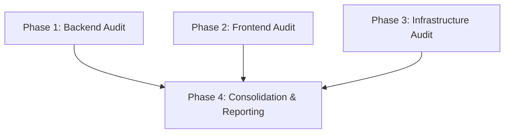

# Implementation Plan: TicketRush Security Audit

## Plan Overview
- **Total Phases**: 4
- **Agents Involved**: `security_engineer`
- **Estimated Effort**: High

## Dependency Graph

## Execution Strategy

| Phase | Description | Agent | Mode |
|-------|-------------|-------|------|
| 1 | Backend & API Audit | `security_engineer` | Parallel |
| 2 | Frontend Audit | `security_engineer` | Parallel |
| 3 | Infrastructure Audit | `security_engineer` | Parallel |
| 4 | Consolidation & Reporting | `security_engineer` | Sequential |

## Phase Details

### Phase 1: Backend & API Audit
- **Objective**: Identify vulnerabilities in Go backend (auth, data validation, business logic).
- **Agent**: `security_engineer`
- **Files to Read**:
  - `internal/middleware/*.go`
  - `internal/handler/*.go`
  - `internal/service/*.go`
  - `internal/models/*.go`
  - `internal/repository/*.go`
- **Validation**: Ensure all major trust boundaries are mapped.
- **Dependencies**: None. `blocked_by`: []

### Phase 2: Frontend Audit
- **Objective**: Identify vulnerabilities in React frontend (XSS, token storage, CSRF).
- **Agent**: `security_engineer`
- **Files to Read**:
  - `frontend/src/services/*.js/jsx`
  - `frontend/src/context/*.js/jsx`
  - `frontend/src/utils/*.js/jsx`
  - `frontend/package.json`
- **Validation**: Trace JWT/Auth handling on the client side.
- **Dependencies**: None. `blocked_by`: []

### Phase 3: Infrastructure & Configuration Audit
- **Objective**: Identify misconfigurations and exposed secrets in Docker and env files.
- **Agent**: `security_engineer`
- **Files to Read**:
  - `Dockerfile.backend`
  - `Dockerfile.frontend`
  - `docker-compose.yml`
  - `docker-entrypoint.sh`
- **Validation**: Review base images, exposed ports, and secret mounting strategies.
- **Dependencies**: None. `blocked_by`: []

### Phase 4: Consolidation & Reporting
- **Objective**: Aggregate findings from Phases 1-3 and write `docs/SYSTEM_AUDIT_REPORT.md`.
- **Agent**: `security_engineer`
- **Files to Create**: `docs/SYSTEM_AUDIT_REPORT.md`
- **Validation**: Ensure report includes CVSS scores, actionable remediation, and covers all scope areas.
- **Dependencies**: `blocked_by`: [1, 2, 3]

## Risk Classification
- **Phase 1 (Backend)**: HIGH - Complex business logic and data access paths.
- **Phase 2 (Frontend)**: MEDIUM - Standard React app, risks primarily around token storage and XSS in dynamic rendering.
- **Phase 3 (Infra)**: LOW - Standard Docker-compose setup, risks are usually evident in config files.
- **Phase 4 (Reporting)**: LOW - Consolidation task.

## Execution Profile
- Total phases: 4
- Parallelizable phases: 3 (in 1 batch)
- Sequential-only phases: 1
